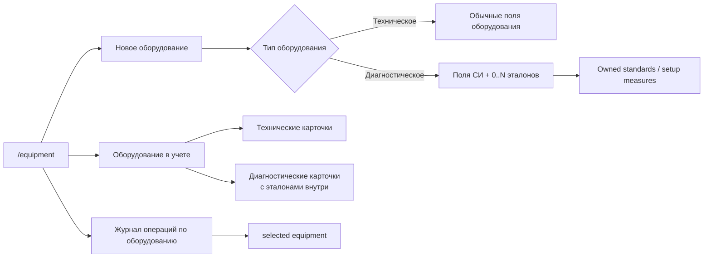

# Equipment Domain Correction Plan

Дата: 2026-05-11  
Статус: frozen slice plan, production code pending

## Контекст

Встреча с заказчиком уточнила предметную модель оборудования:

- `СИ` в MVP означает диагностическое оборудование заказчика, а не отдельный самостоятельный реестр и не оборудование подрядчика;
- технологическое оборудование — обычное оборудование производственного/ремонтного процесса;
- диагностическое оборудование проверяет качество ремонта или состояние узлов вагона;
- эталон / установочная мера находится в комплекте конкретного диагностического оборудования;
- у одного диагностического оборудования может быть несколько эталонов;
- эталон не переиспользуется между несколькими диагностическими устройствами;
- рабочая настройка прибора на своем эталоне не является официальной операцией журнала;
- официальный метрологический сценарий фиксируется журналом/протоколом по оборудованию, но оборудование внешнего метролога не заводится в MVP.

Текущие slice-004/slice-005 остаются historical floor: они доказали route `/equipment`, registry access, journal-driven status и archive behavior. Этот correction slice заменяет устаревшую UI/data language без расширения в Stage 04.

## Целевой вид страницы `/equipment`

- Один public route: `/equipment`.
- Заголовок страницы: `Оборудование`.
- Badge: `Управление реестром` для `manage_equipment`, иначе `Только просмотр`.
- Один рабочий surface: `Оборудование в учете`.
- Нет tabs/switcher `Оборудование / СИ / Эталоны`.
- Query params старых tabs (`tab=mi`, `tab=standards`) не ломают страницу и нормализуются к единому surface.
- Explicit archive visibility остается отдельным toggle/button.

Диаграмма фиксирует целевой composition: одна форма, единый список и единый journal block. Эталоны больше не являются отдельной точкой входа.

## Форма `Новое оборудование`

Общие поля:

- `Тип оборудования`: `Техническое` / `Диагностическое`;
- юнит владения;
- статус;
- документ / ссылка;
- комментарий.

Для `Техническое`:

- производитель;
- класс / тип;
- модель;
- полное наименование;
- заводской номер;
- инвентарный номер;
- год выпуска.

Для `Диагностическое`:

- наименование;
- тип / класс;
- модель;
- ФИФ / регистрационный номер;
- серийный номер;
- опциональная связь с технологическим оборудованием;
- `0..N` эталонов / установочных мер в этой же форме.

Поля эталона в диагностической форме:

- тип / модель;
- идентификатор / серийный номер;
- метрологические характеристики;
- документ / ссылка;
- комментарий.

Запрещено возвращать в форму:

- свободный many-to-many selector `Связанные эталоны`;
- создание эталона без выбранного диагностического оборудования;
- отдельный журнал операции по эталону.

## Список `Оборудование в учете`

Карточка технического оборудования:

- основные поля: производитель, класс/тип, модель, полное наименование;
- заводской/инвентарный номер;
- статус;
- archive/edit actions для mutable active records.

Карточка диагностического оборудования:

- наименование, тип/класс, модель;
- ФИФ / регистрационный номер;
- серийный номер;
- связь с технологическим оборудованием, если есть;
- derived метрологический статус и ближайшая дата;
- `Эталоны: N`;
- компактный список эталонов внутри карточки;
- последняя официальная операция журнала;
- archive/edit actions для mutable active records.

Эталоны просматриваются только внутри карточки диагностического оборудования. Отдельного списка эталонов больше нет.

## Единый журнал

Блок называется `Журнал операций по оборудованию`.

- Пользователь выбирает оборудование из единого списка.
- Для технического оборудования журнал может быть пустым или недоступным по business rules, но UI остается единым.
- Для диагностического оборудования журнал фиксирует официальные операции: поверка, калибровка, техобслуживание, приостановка, вывод.
- `executorOrganization` отражает внутреннего метролога или аккредитованную организацию как исполнителя операции.
- Рабочая настройка прибора на собственном эталоне не является обязательной записью журнала.
- Отдельного standard journal в target UI больше нет.

## Data/API Plan

### Conservative implementation path

Разрешенный низкорисковый путь:

- сохранить существующий backend table/API `registry_measuring_instruments` / `/measuring-instruments` как implementation detail;
- на product/web boundary показывать его как diagnostic equipment;
- добавить parent relation `standard -> diagnostic equipment`;
- прекратить использовать many-to-many `registry_measuring_instrument_standards` как target relationship;
- оставить legacy endpoints только как compatibility layer там, где это снижает migration risk.

### Persistence target

- `registry_equipment` получает product discriminator или response-level `equipmentType`:
  - `technical`;
  - `diagnostic`.
- Diagnostic records may continue to live in `registry_measuring_instruments` during this correction if response/API hides the storage split.
- `registry_standards` gets a required parent diagnostic equipment id for target-owned standards.
- Backfill:
  - if a standard has exactly one measuring-instrument link, set parent to that diagnostic equipment;
  - if a standard has multiple links, create per-parent copies or explicitly block/report in migration strategy;
  - historical journal rows remain readable where present, but target UI stops exposing standard journal mutation.

### API target

- Create/update payload supports one form:
  - technical equipment payload;
  - diagnostic equipment payload with inline standards.
- Response exposes unified equipment records with:
  - `equipmentType`;
  - technical fields when `technical`;
  - diagnostic fields and owned `standards` when `diagnostic`;
  - journal summary from equipment/diagnostic journal.
- Preferred nested standards behavior:
  - create standards through diagnostic equipment context;
  - in the diagnostic equipment edit modal, apply added standards and physically deleted standards only after `Сохранить изменения`;
  - hard-delete removed owned standards through the diagnostic equipment context and remove legacy standard-journal rows for that standard;
  - reject attaching an existing standard to another diagnostic equipment;
  - archived diagnostic equipment rejects new standards and owned-standard delete mutations.
- Journal behavior:
  - equipment journal entries are attached to equipment/diagnostic equipment;
  - archived equipment rejects new journal entries;
  - existing read-only history remains accessible.

## Web Implementation Plan

1. Reuse/extend `EquipmentRegistryWorkspace`; do not create a new page.
2. Remove user-facing `Tabs`.
3. Keep route compatibility for `tab=mi` and `tab=standards` by rendering or redirecting to `/equipment`.
4. Replace separate create forms with one `Новое оборудование` form.
5. Add required type selector `Техническое | Диагностическое`.
6. For diagnostic type, render diagnostic fields plus dynamic standards list.
7. Render one list `Оборудование в учете`.
8. Render standards only inside diagnostic cards.
9. Replace MI/standard-specific journal panels with `Журнал операций по оборудованию`.
10. Update API types, proxy usage, Storybook fixtures, and smoke tests.
11. Keep scoped mutate/read-only/archive behavior unchanged.

## Storybook/Test Plan

Storybook `EquipmentRegistryWorkspace` stories:

- `TechnicalEquipmentList`;
- `DiagnosticEquipmentWithStandards`;
- `DiagnosticEquipmentWithoutStandards`;
- `UnifiedJournal`;
- `ScopedReadonly`;
- `ArchiveVisible`;
- `LoadError`;
- `LongEquipmentList`.

Runtime/e2e proof:

- old `tab=mi` and `tab=standards` URLs do not break `/equipment`;
- no registry tabs are visible;
- type selector is visible;
- diagnostic create supports multiple standards;
- diagnostic edit supports adding new owned standards and physically deleting existing owned standards on save;
- standards are visible only in diagnostic equipment card;
- unified journal is visible and not labeled as standard journal;
- contractor session does not receive customer equipment registry;
- scoped read-only and archive visibility continue to work.

Backend/direct API proof:

- create technical equipment;
- create diagnostic equipment with two owned standards;
- prove standard cannot be reused by another equipment record;
- create equipment journal entry and verify derived status/nextDueDate;
- archive parent and prove new journal/standard mutations are rejected while read-only history remains.

## Main Risks

- The existing backend already uses separate `equipment`, `measuring-instruments`, and `standards` services. The correction should hide or bridge that split without a risky full rewrite unless required.
- Old copy around `СИ` and `эталоны` can remain in source comments/tests as historical proof, but current UI/docs must not present standards as a reusable free registry.
- Query-backed tabs exist in smoke tests and docs; they must be updated to compatibility-only behavior.
- The slice must not pull in Аршин, contractor equipment, or accredited-organization equipment master data.
