# Stage Spec

- Stage ID: 03-identity-master-data
- Stage Name: Identity and master data

## Objective

Активировать поверх Stage 02 runtime shell реальный контур identity, access и master data: first-admin invite activation, постоянный `organization -> division -> unit` management UI, сотрудники и приглашения, scoped access, договоры, оборудование, средства измерения и эталоны.

## In scope

- first-admin activation по invite link и переход в постоянный `/company` management UI вместо ручной раздачи паролей и одноразового launch wizard;
- real auth flow для Stage 03 surfaces:
  - login
  - logout
  - refresh / session restore
  - role-aware access
- organization profile с разделением на launch-critical и optional requisites;
- division registry для подразделений/филиалов без user-facing selector-а типа;
- unit registry как primary operational scope, в том числе сценарий без промежуточного подразделения;
- user accounts, organization memberships и scoped grants как отдельные сущности;
- canonical role templates `organization_admin`, `organization_head`, `division_head`, `division_operator`, `unit_head`, `unit_operator`, `auditor`, role/scope compatibility и invitation lifecycle для сотрудников;
- contractor/customer relation layer и contracts registry как request-routing prerequisite;
- equipment registry;
- measuring instruments registry;
- standards registry;
- metrology operation journals, URL/reference attachment baseline и status derivation from latest valid record;
- bounded ownership-scope labels for standards; broader org-scoped dictionary/local-draft CRUD deferred;
- archive baseline для ключевых master-data сущностей;
- canonical doc sync для product, architecture и stage boundaries.

## Out of scope

- live request contour и request detail workflow;
- contractor execution, materials, estimate approval и acceptance loops;
- fine-grained custom role builder по чекбоксам;
- Yandex ID как обязательный auth path;
- 2FA;
- массовый Excel import;
- автосоздание оргструктуры из внешних систем;
- physical delete для ключевых master-data сущностей;
- самостоятельный отраслевой метрологический модуль вне master-data contour.

## Source documents

- docs/roadmap.md
- docs/PRD-MVP.md
- docs/architecture/identity-master-data.md
- docs/design/customer-admin-bootstrap-flow.md
- docs/architecture/frontend-architecture.md
- AGENTS.md
- progress.md
- feature_list.json

## Product correction from 2026-04-29

Historical Stage 03 evidence proves the older launch-wizard implementation. The target product contract is now stricter:

- `/company/setup` and one-time launch wizard are not the desired UX;
- first-admin invite acceptance should land on `/company`;
- `/company` must support empty, partial, and populated organization states;
- organization-scope admins must be able to create first and later divisions/branches and units from the same persistent management surface;
- division/unit scoped users remain read-only within their visible subtree;
- employee invite creation must not depend on a completed wizard, but division/unit-scoped invites still require an existing visible active target scope.

Treat this as a bounded follow-up Stage 03 correction before claiming product-complete org-structure management.

## Frozen phasing inside Stage 03

### Transition gate from Stage 02

- `Stage 02` is now fully proven and provides a stable runtime/platform floor for Stage 03.
- `Stage 03` may rely on:
  - the proven web runtime shell/docs boundary from Stage 02;
  - root startup and smoke contract from `Makefile` + `compose.platform.yml`;
  - the existing `apps/field` scaffold as a real, but still intentionally narrow, platform contour.
- If Stage 03 changes env/runtime/bootstrap assumptions, refresh Stage 03 docs and evidence in the same slice instead of mutating Stage 02 artifacts silently.
- `Stage 03` cannot be declared fully done until:
  - all required Stage 03 features are proven;
  - the last fresh verifier for Stage 03 returns `PASS`.

### Required slice order

`Stage 03` is executed as one bounded slice at a time in this order:

1. `slice-001-first-admin-activation-and-org-graph`
2. `slice-002-employee-invites-and-scoped-access`
3. `slice-003-contracts-routing-and-workspace-access`
4. `slice-004-equipment-mi-standard-registries`
5. `slice-005-metrology-journals-archiving-and-proof`
6. `slice-006-stage03-review-hardening`
7. `slice-007-stage03-admin-surface-auth-hardening`
8. `slice-008-stage03-multi-org-session-contract`
9. `slice-009-stage03-equipment-truthfulness`
10. `slice-010-stage03-org-structure-management`

```mermaid
flowchart LR
    A["Stage 02 shell + platform floor proven"] --> B["Slice 001<br/>first admin + org graph"]
    B --> C["Slice 002<br/>employee invites + scoped access"]
    C --> D["Slice 003<br/>contracts + workspace routing"]
    D --> E["Slice 004<br/>equipment + MI + standards registries"]
    E --> F["Slice 005<br/>journals + archiving"]
    F --> G["Slice 006<br/>review hardening"]
    G --> H["Slice 007<br/>admin auth hardening"]
    H --> I["Slice 008<br/>explicit session contract"]
    I --> J["Slice 009<br/>equipment truthfulness"]
    J --> K["Slice 010<br/>persistent /company org management"]
    K --> L["Stage 03 PASS"]
```

The diagram fixes the execution order after Stage 02 closure and after the later post-proof remediation wave: Stage 03 still starts from a stable runtime/platform floor, and the reopened slices remain bounded to truthfulness/product-correction fixes instead of widening into Stage 04 request scope.

## Acceptance criteria

- платформенный админ может создать организацию-заготовку и отправить first-admin invite;
- первый администратор принимает приглашение, задает пароль и попадает в `/company`, а не в пустой кабинет или одноразовый wizard;
- `/company` покрывает как минимум:
  - профиль организации;
  - empty / partial / populated states оргструктуры;
  - создание первого и последующих подразделений/филиалов;
  - создание первого и последующих юнитов, включая direct `organization -> unit`;
  - редактирование business fields: organization `propertyType`/`type` alias as legal-form selector `ООО` / `АО` / `ПАО` with legacy `ОАО -> ПАО`, `ЗАО -> АО`, `LLC -> ООО`; division/branch has no selectable type and stores hidden internal default only for compatibility; unit keeps operational type selector `ВРД` / `ВРЗ` / `ВУ` / `ВРП`; name, registeredAddress/address alias, leaderFullName with managerName migration/display compatibility, leaderPosition, contractPhone, contractEmail, actingBasis, plus code/region/status/comment where those fields still exist in the model;
  - архивирование подразделений/юнитов вместо удаления;
  - приглашение сотрудников с проверкой существующего target scope для division/unit invites;
  - entry points к добавлению оборудования после появления юнита;
- org/division/unit модель поддерживает иерархию с optional division;
- user account, membership и scoped grant разделены и доказаны сценариями доступа;
- organization-scope права наследуются вниз, division-scope права наследуются на дочерние unit, deny-layer отсутствует;
- canonical roles are enforced by scope: organization roles only on organization scope, division roles only on division scope, unit roles only on unit scope, and `auditor` on any organization/division/unit scope;
- Stage 03 v1 mutate capabilities are limited to active customer `organization_admin` on organization scope; `organization_head`, `division_head`, `division_operator`, `unit_head`, `unit_operator`, and `auditor` remain scope-aware read-only roles until later stages enable more capability-map entries;
- invitation statuses `draft`, `sent`, `opened`, `accepted`, `expired`, `revoked` видимы и воспроизводимы;
- login/session restore возвращает contour, привязанный к explicit active membership/grant: customer contour на `/company`, active contractor contour на `/contracts`;
- direct login с несколькими eligible memberships/grants truthfully возвращает `409`, а не silently выбирает один workspace;
- `/platform/organization-shells` и Stage 03 `organizations` admin surface не доступны анонимно и не раскрывают deployment-scoped admin credential в browser;
- contracts registry ограничивает допустимого подрядчика для следующего request stage;
- equipment, measuring instruments и standards существуют как отдельные реестры, без общей mega-form;
- текущий метрологический статус вычисляется из последней действующей записи журнала;
- archive используется вместо hard delete, а archived rows открываются только через explicit archive visibility;
- канонические docs и stage artifacts синхронизированы и пригодны для Stage 04 handoff.

## Technical ownership / paths

- apps/backend/internal/auth/
- apps/backend/internal/db/
- apps/backend/docs/swagger/
- apps/web/app/(runtime)/
- apps/web/features/
- apps/web/entities/
- apps/web/shared/
- docs/roadmap.md
- docs/PRD-MVP.md
- docs/architecture/identity-master-data.md
- docs/design/customer-admin-bootstrap-flow.md
- .agent/stages/03-identity-master-data/

## Risks

- текущий legacy backend уже содержит ранние CRUD для организаций, оборудования, СИ и эталонов, но их модель не совпадает с новым Stage 03 contract;
- stage легко раздуть, если request workflow из Stage 04 или contractor execution из Stage 05 попадут в тот же slice;
- invite/auth flow и scoped access могут разойтись между backend и web, если не держать один canonical contract;
- метrology slice легко деградирует в денормализованные `last/next date`, если журнал операций не будет treated as source of truth;
- существующие route shells из Stage 02 могут начать притворяться live flow раньше реальной активации backend contract.

## Verification plan

- before each slice, re-sync the proven Stage 02 runtime/platform floor and check whether local assumptions still hold;
- verify each slice independently before moving to the next one;
- прогнать first-admin activation end-to-end;
- доказать first and repeat org/division/unit management через постоянный `/company` UI и scoped singular-session landing без multi-workspace picker;
- доказать invitation lifecycle и scoped access inheritance сценариями organization / division / unit;
- доказать truthful `409` при direct login, если у аккаунта несколько eligible access paths;
- доказать contracts registry и contractor restriction baseline;
- доказать separate registries для equipment / measuring instruments / standards;
- доказать journal-driven status calculation и archive behavior;
- зафиксировать updated canonical docs и diagram refs в evidence;
- завершать только после fresh verifier pass.
