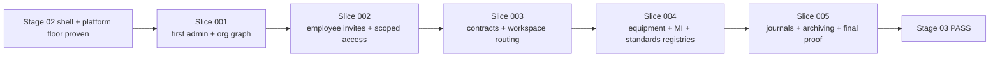

# Stage Spec

- Stage ID: 03-identity-master-data
- Stage Name: Identity and master data

## Objective

Активировать поверх Stage 02 runtime shell реальный контур identity, access и master data: first-admin invite activation, `organization -> subdivision -> unit`, сотрудники и приглашения, scoped access, договоры, оборудование, средства измерения и эталоны.

## In scope

- first-admin activation по invite link и launch wizard вместо ручной раздачи паролей;
- real auth flow для Stage 03 surfaces:
  - login
  - logout
  - refresh / session restore
  - role-aware access
- organization profile с разделением на launch-critical и optional requisites;
- subdivision registry с типом подразделения;
- unit registry как primary operational scope, в том числе сценарий без промежуточного подразделения;
- user accounts, organization memberships и scoped grants как отдельные сущности;
- role templates, additive inheritance и invitation lifecycle для сотрудников;
- contractor/customer relation layer и contracts registry как request-routing prerequisite;
- equipment registry;
- measuring instruments registry;
- standards registry;
- metrology operation journals, attachments и status derivation from latest valid record;
- organization-scoped dictionaries с local draft entries;
- archive baseline для ключевых master-data сущностей;
- canonical doc sync для product, architecture и stage boundaries.

## Out of scope

- live request contour и request detail workflow;
- contractor execution, materials, estimate approval и acceptance loops;
- fine-grained custom role builder по чекбоксам;
- Yandex ID как обязательный auth path;
- 2FA;
- массовый Excel import;
- автосоздание оргструктуры из внешних систем;
- physical delete для ключевых master-data сущностей;
- самостоятельный отраслевой метрологический модуль вне master-data contour.

## Source documents

- docs/roadmap.md
- docs/PRD-MVP.md
- docs/architecture/identity-master-data.md
- docs/design/customer-admin-bootstrap-flow.md
- docs/architecture/frontend-architecture.md
- AGENTS.md
- progress.md
- feature_list.json

## Frozen phasing inside Stage 03

### Transition gate from Stage 02

- `Stage 02` is now fully proven and provides a stable runtime/platform floor for Stage 03.
- `Stage 03` may rely on:
  - the proven web runtime shell/docs boundary from Stage 02;
  - root startup and smoke contract from `Makefile` + `compose.platform.yml`;
  - the existing `apps/field` scaffold as a real, but still intentionally narrow, platform contour.
- If Stage 03 changes env/runtime/bootstrap assumptions, refresh Stage 03 docs and evidence in the same slice instead of mutating Stage 02 artifacts silently.
- `Stage 03` cannot be declared fully done until:
  - all required Stage 03 features are proven;
  - the last fresh verifier for Stage 03 returns `PASS`.

### Required slice order

`Stage 03` is executed as one bounded slice at a time in this order:

1. `slice-001-first-admin-activation-and-org-graph`
2. `slice-002-employee-invites-and-scoped-access`
3. `slice-003-contracts-routing-and-workspace-access`
4. `slice-004-equipment-mi-standard-registries`
5. `slice-005-metrology-journals-archiving-and-proof`

The diagram fixes the execution order after Stage 02 closure: Stage 03 now starts from a stable runtime/platform floor instead of carrying an open cross-stage blocker.

## Acceptance criteria

- платформенный админ может создать организацию-заготовку и отправить first-admin invite;
- первый администратор принимает приглашение, задает пароль и попадает в launch wizard, а не в пустой кабинет;
- launch wizard покрывает как минимум:
  - организацию;
  - первое подразделение или сразу первый юнит;
  - приглашение сотрудников;
  - добавление первого оборудования;
- org/subdivision/unit модель поддерживает иерархию с optional subdivision;
- user account, membership и scoped grant разделены и доказаны сценариями доступа;
- organization-scope права наследуются вниз, subdivision-scope права наследуются на дочерние unit, deny-layer отсутствует;
- invitation statuses `draft`, `sent`, `opened`, `accepted`, `expired`, `revoked` видимы и воспроизводимы;
- contracts registry ограничивает допустимого подрядчика для следующего request stage;
- equipment, measuring instruments и standards существуют как отдельные реестры, без общей mega-form;
- текущий метрологический статус вычисляется из последней действующей записи журнала;
- archive используется вместо hard delete;
- канонические docs и stage artifacts синхронизированы и пригодны для Stage 04 handoff.

## Technical ownership / paths

- apps/backend/internal/auth/
- apps/backend/internal/db/
- apps/backend/docs/swagger/
- apps/web/app/(runtime)/
- apps/web/features/
- apps/web/entities/
- apps/web/shared/
- docs/roadmap.md
- docs/PRD-MVP.md
- docs/architecture/identity-master-data.md
- docs/design/customer-admin-bootstrap-flow.md
- .agent/stages/03-identity-master-data/

## Risks

- текущий legacy backend уже содержит ранние CRUD для организаций, оборудования, СИ и эталонов, но их модель не совпадает с новым Stage 03 contract;
- stage легко раздуть, если request workflow из Stage 04 или contractor execution из Stage 05 попадут в тот же slice;
- invite/auth flow и scoped access могут разойтись между backend и web, если не держать один canonical contract;
- метrology slice легко деградирует в денормализованные `last/next date`, если журнал операций не будет treated as source of truth;
- существующие route shells из Stage 02 могут начать притворяться live flow раньше реальной активации backend contract.

## Verification plan

- before each slice, re-sync the proven Stage 02 runtime/platform floor and check whether local assumptions still hold;
- verify each slice independently before moving to the next one;
- прогнать first-admin activation end-to-end;
- доказать org/subdivision/unit creation и workspace switching;
- доказать invitation lifecycle и scoped access inheritance сценариями organization / subdivision / unit;
- доказать contracts registry и contractor restriction baseline;
- доказать separate registries для equipment / measuring instruments / standards;
- доказать journal-driven status calculation и archive behavior;
- зафиксировать updated canonical docs и diagram refs в evidence;
- завершать только после fresh verifier pass.
