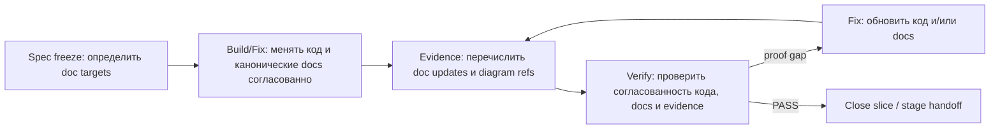

# Documentation Workflow

Статус: accepted  
Обновлено: 2026-04-12

## Назначение

Этот документ задает обязательный `doc-sync` для agent-first разработки в VRK. Его цель: не допускать расхождения между кодом, принятыми решениями и канонической документацией, а также постепенно собирать читаемую техническую документацию по продукту.

## Когда doc-sync обязателен

Агент обязан обновить документацию в том же logical slice, если в ходе работы он:

- изменил пользовательское поведение, бизнес-правило или product contract;
- уточнил неоднозначность и фактически принял новое решение по архитектуре, интеграции, статусной модели, workflow или данным;
- изменил API contract, setup/runtime expectations или developer workflow;
- добавил новый важный модуль, границу ответственности, integration path или proof/verification policy;
- обнаружил, что текущая документация противоречит уже принятому и реализованному решению.

Молчаливый documentation drift считается дефектом workflow, а не допустимым побочным эффектом разработки.

## Куда писать канонические изменения

Обновляй самый узкий источник истины, который реально владеет соответствующим решением:

- product scope, stage flow и roadmap guardrails: `docs/roadmap.md`, `docs/PRD-MVP.md`;
- repo-wide source of truth и workflow policy: `AGENTS.md`, `docs/architecture/source-of-truth.md`, этот документ;
- архитектурные решения и границы: `docs/architecture/*.md`, при необходимости новый ADR;
- API contract: source annotations/schema и `apps/backend/docs/swagger/*`;
- UI workflow, design rules и component policy: `docs/design/*`;
- setup, launch, локальные команды и operational notes: `README.md`, `docs/onboarding.md`, `CONTRIBUTING.md`.

Stage artifacts в `.agent/stages/<stage-id>/` обязательны для handoff и proof, но не заменяют каноническую техдокументацию.

## Что должно попадать в stage artifacts

Каждый нетривиальный slice должен оставлять в evidence:

- список обновленных канонических docs;
- краткое описание зафиксированных решений;
- ссылки на добавленные или обновленные диаграммы;
- явную пометку, если документация сознательно не менялась, и почему это корректно.

`progress.md` фиксирует doc debt только как исключение. По умолчанию решения должны документироваться в той же сессии, в которой они были приняты.

## Правила для диаграмм

Диаграммы обязательны, если текст без них уже плохо объясняет поведение системы. В первую очередь это касается:

- state machine и lifecycle flows;
- orchestration и handoff между агентами/ролями;
- request-routing, approval и acceptance flows;
- offline/sync и retry/conflict paths;
- data flow или interaction между несколькими модулями/подсистемами.

Правила оформления:

- по умолчанию использовать Mermaid, чтобы диаграммы жили рядом с текстом и versioned вместе с кодом;
- делать диаграммы маленькими и целевыми, а не одну огромную “карту всего”;
- рядом с диаграммой оставлять короткое пояснение, что именно она фиксирует и какие ограничения у нее есть;
- при изменении поведения обновлять существующую диаграмму, а не создавать противоречащую новую.

## Doc-sync loop для stage workflow

Диаграмма фиксирует минимальный цикл, в котором documentation sync является частью proof, а не постфактум cleanup-задачей.

Внутри stage harness применяется такой цикл:

1. во время spec freeze определить doc targets и необходимость диаграмм;
2. во время build/fix обновить код и канонические docs согласованно;
3. перед verify убедиться, что evidence перечисляет doc changes;
4. verifier проверяет, что docs не расходятся с реализованным slice;
5. при выявлении drift агент чинит не только код, но и docs, если именно они являются proof gap.

## Что verifier должен считать proof gap

Verifier обязан считать существенным proof gap хотя бы один из следующих случаев:

- измененное поведение доказано кодом, но канонические docs описывают другой contract;
- slice принял новое архитектурное или workflow-решение, но оно осталось только в коде/evidence;
- нетривиальный flow усложнился, но техническая документация не была обновлена и больше не объясняет систему;
- evidence утверждает, что решение принято, но в канонических docs оно не зафиксировано.

Незначительные текстовые шероховатости сами по себе не должны блокировать stage. Блокировать должны содержательные расхождения, которые мешают следующему агенту или разработчику понять и безопасно продолжить работу.

## Практическое правило завершения сессии

Перед завершением работы агент должен ответить на три вопроса:

1. Какие решения были приняты или уточнены в этой сессии?
2. В каком каноническом документе теперь отражено каждое из них?
3. Нужна ли диаграмма, чтобы следующий человек или агент понял эту часть системы без reverse engineering из кода?

Если на любой из этих вопросов нет внятного ответа, работу нельзя считать полностью закрытой.
