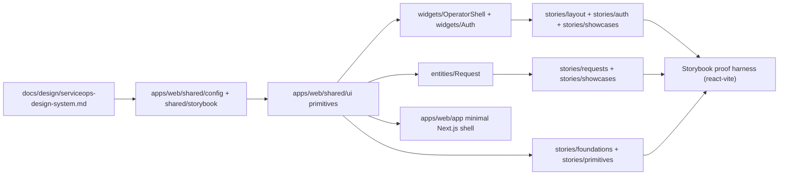
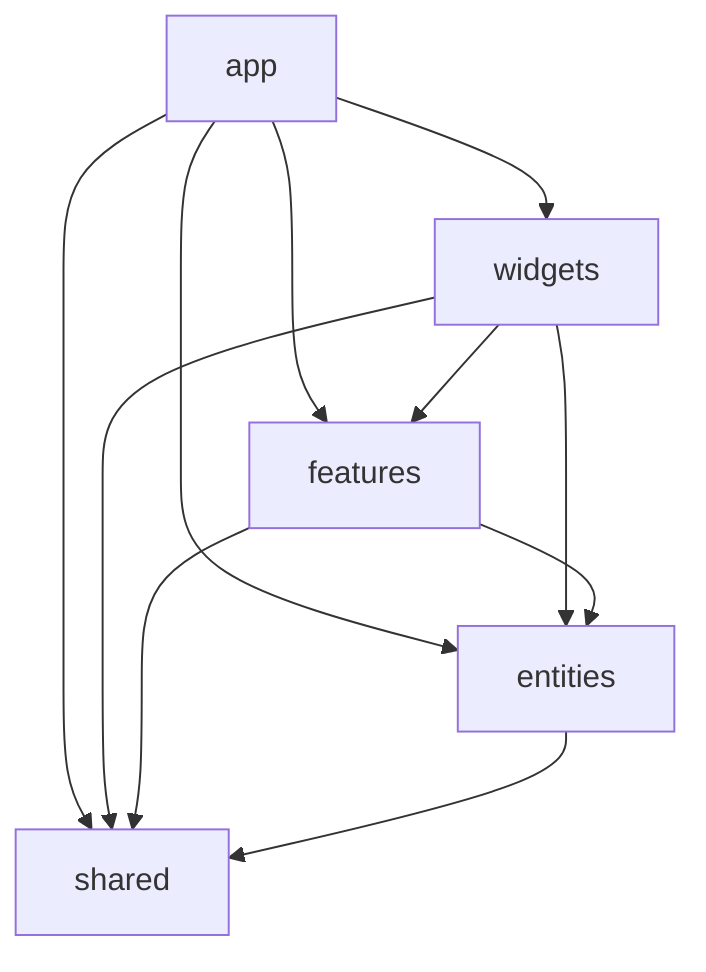

# Архитектура фронтенда и практики разработки

Статус: accepted baseline  
Обновлено: 2026-04-12

## Назначение

Этот документ фиксирует архитектуру и инженерные практики для `apps/web` в VRK.

Важно: после Stage 01 в репозитории уже существует `apps/web`, но его текущий runnable baseline ограничен Storybook-first UI foundation: shared primitives, Wave 1 shell/auth/request-list slices и showcase stories без реального business/runtime wiring. Полноценный business/runtime контур `apps/web` остается задачей Stage 02.

## Смежные документы

- repo-wide source of truth: `docs/architecture/source-of-truth.md`
- doc-sync policy: `docs/architecture/documentation-workflow.md`
- roadmap stages for web contour: `docs/roadmap.md`
- UI workflow: `docs/design/ui-workflow.md`
- design system and tokens: `docs/design/serviceops-design-system.md`
- Storybook source backlog: `docs/design/storybook-component-backlog.md`
- Git / PR / commit rules: `CONTRIBUTING.md`

## 0. Общие принципы

- Одна логическая задача = один обозримый PR.
- Перед новым паттерном сначала смотрим, как уже сделано в репозитории и в канонических docs.
- Интерфейс и пользовательский текст пишем на русском. Код, идентификаторы, типы и API-контракты держим на английском.
- По умолчанию предпочитаем server-first архитектуру, явные boundaries и минимальную гидрацию.
- Переиспользуемые UI-срезы считаются законченными только вместе со stories, обязательными state variants и review gate из `docs/design/ui-workflow.md`.
- Если реализация изменила или уточнила правила из этого документа, doc-sync обязателен в той же сессии.

## 1. Целевой стек и контур

Планируемый web baseline для VRK:

- `apps/web` — `Next.js` App Router + `React` + `TypeScript`
- UI stack — `Tailwind CSS`, `Radix UI primitives`, shadcn/ui-style open code, `class-variance-authority`, shared `cn()`
- forms — `react-hook-form` + `zod`
- data-dense surfaces — `@tanstack/react-table`
- charts — `recharts`
- icons — `lucide-react`
- backend integration — `apps/backend` через REST + OpenAPI contract

Этот документ описывает прежде всего `apps/web`.
`apps/field` будет отдельным контуром, но базовые правила по типизации, data layer, naming и doc-sync должны по возможности оставаться согласованными.

### 1.1. Текущий Stage 01 baseline

Сейчас `apps/web` состоит из трех согласованных, но намеренно разделенных слоев:

- `Next.js` App Router app для минимального landing shell и будущего runtime growth path;
- reusable base в `shared/*`: design tokens, story helpers и UI primitives;
- Vite-backed Storybook harness с Wave 1 slices в `widgets/*` и `entities/*` для layout/navigation, auth baseline, request-list baseline и showcase-композиций без раннего смешивания со Stage 02 runtime wiring.



Диаграмма фиксирует Stage 01 contract: design tokens и story helpers питают shared primitives, поверх которых уже собраны Wave 1 `widgets` и `entities`, а runtime shell остается минимальным и не тянет business integration раньше Stage 02.

## 2. Архитектурный каркас: Adapted FSD для `apps/web`

Целевые слои сверху вниз:

```text
apps/web/app        # routing, layouts, page composition, route-level data orchestration
apps/web/widgets    # page sections and screen blocks
apps/web/features   # user actions and scenario-specific interaction slices
apps/web/entities   # domain entities: types, view-models, presentational building blocks
apps/web/shared     # reusable base: ui, lib, api, config, types
```

`features` может появиться не в первом коммите `apps/web`, но direction of growth фиксируем сразу, чтобы не складывать сценарную логику в `widgets` и `entities`.

### 2.1. Направление импортов

Импортируем только вниз по слоям:

```text
app      -> widgets, features, entities, shared
widgets  -> features, entities, shared
features -> entities, shared
entities -> shared
shared   -> external packages only
```



Если для решения задачи хочется импортировать модуль "вверх", значит slice boundaries выбраны неверно или public API неполный.

### 2.2. Public API: импорт только из корня слайса

Каждый slice обязан иметь `index.ts`, который экспортирует только публичный интерфейс.

```ts
// good
import { RequestCard } from "@/entities/Request";

// bad
import { RequestCard } from "@/entities/Request/ui/RequestCard";
```

Если коду нужен внутренний файл, сначала расширяем `index.ts`, а не обходим public API.

### 2.3. Именование директорий

- слой: `lowercase` — `shared`, `widgets`, `entities`
- slice: `PascalCase` — `Request`, `RequestList`, `AuthSession`
- технические директории внутри slice: `lowercase` — `ui`, `model`, `lib`, `api`, `types`

Пример:

```text
apps/web/entities/Request/
  index.ts
  ui/
    RequestCard.tsx
    RequestStatusBadge.tsx
  model/
    request-status.ts
  types/
    request.ts
```

## 3. Ответственность по слоям

### 3.1. `app/`

- содержит route handlers, layouts, pages, route groups и app-level providers
- собирает страницы из `widgets`, `features`, `entities`
- вызывает data layer и приводит данные к props экранов
- не превращается в место для сложной domain-логики и долгих JSX-композиций
- `default export` допустим только там, где это требует Next.js

### 3.2. `widgets/`

- готовые секции и screen blocks
- собирают `entities`, `features` и `shared/ui`
- не ходят напрямую в backend и не читают env
- не владеют глобальными app decisions вроде auth bootstrap, router wiring и cache contract

### 3.3. `features/`

- инкапсулируют пользовательские действия и локальные сценарии
- содержат форму, mutation flow, optimistic/local pending state и success/error plumbing
- не становятся page-level контейнерами и не дублируют базовые entity components

### 3.4. `entities/`

- описывают доменные типы, view-models и компоненты показа данных
- допустимы `Card`, `Row`, `Badge`, `Preview`, `Summary` и аналогичные read-oriented компоненты
- без route composition и без кросс-страничных сценариев

### 3.5. `shared/`

- reusable UI primitives
- `lib` и чистые helpers
- `api` и transport layer
- `config` и env access
- базовые типы, которые не принадлежат одной доменной сущности

В `shared` не живет прикладная логика конкретной заявки, договора, оборудования или роли.

## 4. Data layer и интеграция с backend

Цель: в проекте должен быть один понятный слой доступа к данным, а не случайные `fetch()` по JSX-дереву.

Рекомендуемый baseline:

```text
apps/web/shared/api/
  client/        # base HTTP client, auth/session wiring, common errors
  contracts/     # OpenAPI-generated or hand-maintained contract types
  requests/      # domain-specific queries/mutations
  equipment/
  agreements/
```

Правила:

- backend вызывается через `shared/api/*`, а не напрямую из `widgets`, `entities/ui` или `shared/ui`
- raw API response не протаскивается в UI без адаптации
- mapping в view-model делаем в data layer или route-level orchestration в `app/`
- cache behavior (`revalidate`, tags, bypass, no-store) должен быть явным и единообразным
- ошибки транспорта и contract-level ошибки нормализуются в одном месте
- auth/session contract читается централизованно, а не размазанно по компонентам

### 4.1. Где живет state

Предпочтение по порядку:

1. server data в `app/` и server components
2. URL/search params для фильтров, сортировки и shareable screen state
3. local component state для ephemeral UI behavior
4. общий client store только если есть доказанный cross-route или cross-widget use case

Глобальный client store не считается baseline по умолчанию. Если он появится, решение должно быть явно задокументировано отдельным doc-sync.

## 5. Storybook-first и reusable UI

Для VRK shared UI и reusable domain components должны разрабатываться через Storybook-first workflow из `Stage 01`.

Правила:

- `docs/design/storybook-component-backlog.md` является source backlog для shared/component work
- новые reusable primitives и domain UI-срезы поставляются вместе со stories
- обязательные states:
  - interactive components: `Default`, `Hover`, `Focus`, `Disabled`
  - data components: `Loading`, `Empty`, `Error`
  - responsive components: `Desktop`, `Mobile`
- Storybook подтверждает composability и visual states, но не заменяет route integration и business smoke
- если UI-срез меняет component API, tokens или state behavior, обновляем stories и канонические docs вместе

## 6. Константы, конфиг и окружение

### 6.1. Уровни констант

1. Локальные константы держим рядом с использованием.
2. Slice-specific константы выносим в `model/constants.ts` или `lib/constants.ts`.
3. Project-wide константы размещаем в `shared/lib`, `shared/api` или `shared/config`.

### 6.2. Именование

- экспортируемые таблицы и наборы значений: `SCREAMING_SNAKE_CASE`
- локальные константы внутри файла: `camelCase`
- дизайн-токены должны жить в theme/tokens слое, а не внутри JSX

### 6.3. `as const`, unions и type guards

```ts
export const REQUEST_PRIORITIES = ["normal", "high", "critical"] as const;

export type RequestPriority = (typeof REQUEST_PRIORITIES)[number];

export function isRequestPriority(value: unknown): value is RequestPriority {
  return REQUEST_PRIORITIES.some((priority) => priority === value);
}
```

### 6.4. `process.env`

- env читается в одном месте: `shared/config/*`
- обязательные переменные валидируются на старте
- UI-код не должен читать `process.env` напрямую из случайных компонентов

## 7. Нейминг и стиль кода

### 7.1. Файлы и экспорты

- React components: `PascalCase.tsx`
- utilities and helpers: `kebab-case.ts`
- `index.ts`: только public API, без логики
- вне `app/` по умолчанию используем `named export`

### 7.2. Типы и props

- типы и интерфейсы: `PascalCase`
- props: `ComponentNameProps`
- callbacks в props: `onSubmit`, `onChange`, `onOpen`
- обработчики внутри компонента: `handleSubmit`, `handleOpen`

### 7.3. Переменные и функции

- boolean: `is*`, `has*`, `can*`, `should*`
- коллекции: множественное число
- функции: глагол + объект (`fetchRequests`, `buildRequestHref`, `mapRequestToCardModel`)

### 7.4. Импорты

Порядок:

1. `react`, `next/*`
2. third-party packages
3. внутренние `@/*`
4. относительные импорты
5. `import type ...`

## 8. TypeScript rules

- держим `strict: true`
- `any` избегаем; если тип неизвестен, используем `unknown` и guard
- `as Type` без валидации не считаем нормой
- для конфигов и map-объектов предпочитаем `satisfies`
- contract types и UI view-models не смешиваем без явного mapping layer
- `import type` используем для type-only imports
- domain states и async states по возможности оформляем через discriminated unions, а не через набор несвязанных boolean-флагов

## 9. Next.js и React практики

### 9.1. Server Components по умолчанию

- `'use client'` добавляем только там, где реально нужны state, effects, browser APIs или interactive handlers
- page composition и data orchestration по умолчанию остаются server-side
- тяжелую client-only логику не поднимаем выше необходимого leaf boundary

### 9.2. Формы и мутации

- формы строим на `react-hook-form` + `zod`
- mutation flow живет в `features` или в специально выделенном interaction slice
- optimistic UI допускается только там, где rollback и error state продуманы заранее

### 9.3. Производительность и media

- используем `next/image` вместо голого ``, когда это уместно
- фиксируем размеры и `sizes`, чтобы не ловить layout shift
- `priority` применяем только для реально above-the-fold контента
- не строим интерфейс на тяжелых blur/frosted/glow-эффектах, которые противоречат design system и operational density

### 9.4. Опасные места

- `dangerouslySetInnerHTML` допускается только для доверенного и явно ограниченного контента
- не используем его для сборки UI
- route-level loading, empty и error states считаются обязательной частью реализации, а не "добьем потом"

## 10. Стили, токены и component API

Правила:

- используем semantic tokens из `docs/design/serviceops-design-system.md`
- новые цвета, радиусы, тени и motion values оформляем в токенах, а не размазываем по JSX
- без inline styles, кроме точечных случаев с динамическими CSS variables, где это действительно оправдано
- классы объединяем через `cn()`
- reusable component принимает `className` и не навязывает внешние margins
- по возможности компонент имеет предсказуемые `variant`, `size`, `tone`
- важные компоненты обязаны покрывать `disabled`, `loading`, `empty`, `error`, если эти состояния релевантны

Не создаем параллельные component families без сильной причины. Сначала проверяем, можно ли расширить уже существующий primitive или pattern.

## 11. A11y и SEO как часть DoD

Для каждой страницы, виджета и reusable UI-секции проверяем:

- корректную семантику: `main`, `nav`, `section`, правильные heading levels
- доступность с клавиатуры
- видимый `focus-visible`
- label/description/error text для форм
- контраст и читаемость в data-dense сценариях
- понятные empty/error/loading states
- `title`, `description` и другие SEO-поля для публичных и индексируемых страниц, если такие появятся

Для внутренних кабинетных экранов SEO вторично, но семантика, фокус и читаемость обязательны всегда.

## 12. Что запрещено

- импортировать "вверх" по слоям
- импортировать внутренности slice вместо `index.ts`
- вызывать backend из UI-компонентов напрямую
- складывать доменную логику в `shared/ui`
- протаскивать raw backend contract в JSX без mapping
- размазывать raw hex и magic spacing values по компонентам
- читать `process.env` из случайных файлов
- коммитить `.env*` и секреты
- делать god component на сотни строк без очевидной причины и без декомпозиции
- добавлять второй похожий primitive, если уже существует базовый компонент, который можно расширить

## 13. Практическое правило для будущих stage-срезов

Когда `apps/web` появится, каждый frontend slice должен отвечать на четыре вопроса:

1. В каком слое живет этот код и почему?
2. Почему его import direction не нарушает Adapted FSD?
3. Где проходит граница между backend contract, view-model и UI component API?
4. Какие docs, stories и state variants нужно обновить вместе с кодом?

Если на любой вопрос нет ясного ответа, архитектурный slice еще не достаточно сформулирован.
