# Identity, Access, and Master Data

Статус: accepted baseline  
Обновлено: 2026-05-11

## Назначение

Этот документ фиксирует каноническую доменную модель для `Stage 03` в VRK:

- активация первого администратора организации;
- иерархия `организация -> дивизион -> юнит`;
- сотрудники, приглашения, membership и scoped access;
- master-data контур для договоров, оборудования, СИ и эталонов;
- правила архивирования и target correction для диагностического оборудования / эталонов.

Это не замена `docs/roadmap.md`, а более узкий source of truth для решений, которые уже не помещаются в короткое stage summary.

## Смежные документы

- roadmap и stage boundaries: [`docs/roadmap.md`](../roadmap.md)
- product scope: [`docs/PRD-MVP.md`](../PRD-MVP.md)
- web flow mapping: [`docs/design/customer-admin-bootstrap-flow.md`](../design/customer-admin-bootstrap-flow.md)
- frontend growth path: [`docs/architecture/frontend-architecture.md`](./frontend-architecture.md)
- stage artifacts: [`.agent/stages/03-identity-master-data/`](../../.agent/stages/03-identity-master-data/)

## Граница stage-ов

`Stage 02` поднимает только runtime shell и truthful placeholders.  
`Stage 03` включает реальную доменную активацию.  
`Stage 04` начинает живой request contour на уже существующем master-data слое.

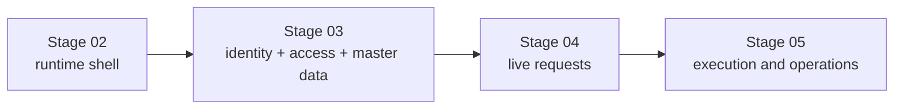

## 1. Активация организации и первого администратора

Основной сценарий запуска организации:

1. платформенный админ создает заготовку организации;
2. указывает email первого администратора;
3. система отправляет одноразовое приглашение;
4. пользователь открывает ссылку, задает пароль;
5. после входа попадает в постоянный `/company` contour организации.

Решения:

- основной путь: `invite link + password setup`;
- ручная раздача логина/пароля не используется как основной сценарий;
- внешний вход вроде Яндекс ID допустим позже как дополнительный путь после открытия приглашения, но не как замена invite acceptance в MVP;
- `invite code` допустим только как резервный offline-friendly сценарий;
- пароль при активации first-admin и employee invite должен содержать минимум 8 символов; дополнительных требований к составу символов нет;
- после активации пользователь не попадает в пустой кабинет или одноразовый wizard, а в рабочий кабинет организации с management actions;
- создание первого дивизиона и первого юнита является частным случаем постоянного UI управления оргструктурой.

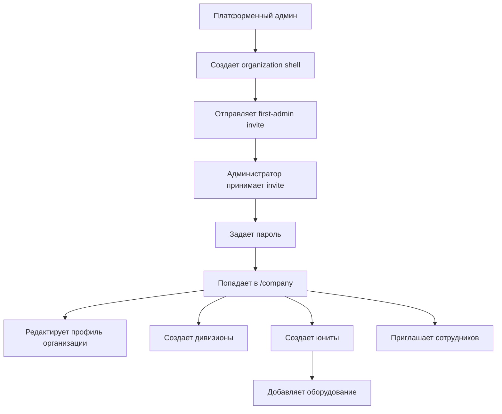

### 1.1. Historical slice-001 contract

В первом живом Stage 03 slice этот сценарий был реализован через launch wizard. Это исторический proof текущей реализации, но продуктовый target от 2026-04-29 заменяет wizard на постоянный `/company` management surface:

- `POST /platform/organization-shells` создает `organization shell` и first-admin invite, но только за deployment-scoped platform-admin boundary;
- публичный `/register` не вызывает backend напрямую: Next route handler inject-ит `X-VRK-Platform-Admin-Secret` server-side, а browser не получает secret;
- `GET /first-admin-invites/{token}` открывает одноразовую ссылку и переводит invite из `sent` в `opened`;
- `POST /first-admin-invites/{token}/accept` задает пароль, создает `membership`, выдает initial `organization_admin` grant и возвращает session;
- повторный `accept` по тому же token возвращает конфликт и не может создать вторую активацию;
- `POST /launch-wizard` сохраняет core organization data и поддерживает оба пути: `organization -> division -> unit` и `organization -> unit`;
- `POST /sessions` и `GET /sessions/current` позволяют вернуться только в тот contour, который привязан к explicit active `membership_id + grant_id`;
- direct login с несколькими eligible access paths возвращает `409` и не делает silent selection.

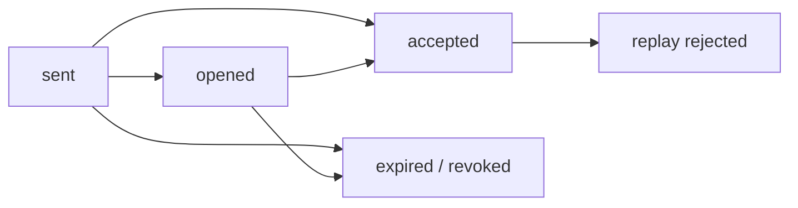

### 1.2. Target correction: organization structure management UI

Следующий Stage 03 correction slice должен убрать зависимость бизнес-логики от "завершенного wizard":

- first-admin invite acceptance сразу выпускает session и ведет администратора на `/company`;
- `/company` показывает empty / partial / populated states организации и не требует отдельного `/company/setup`;
- organization-scope admin может в любое время создавать, редактировать и архивировать дивизионы и юниты;
- создание первого дивизиона и первого юнита использует те же API и UI, что и создание последующих узлов;
- юнит может быть создан под дивизионом или напрямую под организацией;
- organization-scope employee invite доступен active organization admin без wizard gate;
- division/unit-scope employee invite требует существующий visible target scope.

#### 1.2.1. `/company` business-field contract

Для correction slice `slice-010-stage03-org-structure-management` формы профиля организации, дивизиона и юнита используют разделенный field contract:

| Поле | Канонический контракт |
| --- | --- |
| `propertyType` / organization `type` alias | В профиле организации visible selector `Тип` хранит юридическую форму: `ООО`, `ПАО`, `НАО`, `ИП`. `type` остается compatibility alias в API/session там, где старые клиенты уже читают это поле. Legacy input `АО` и `ЗАО` нормализуется в `НАО`, `ОАО` в `ПАО`, `LLC` в `ООО`; legacy aliases не показываются как актуальные options. `НАО` является продуктовым user-facing значением для непубличного АО. |
| `logo` | В session/API хранится только metadata (`fileName`, `contentType`, `sizeBytes`, `updatedAt`, `url`). Бинарный файл живет в приватном S3-compatible object storage и читается через authenticated backend/web proxy route. |
| requisites | Optional until filled: `postalAddress`, `ogrn`, `settlementAccount`, `bankName`, `correspondentAccount`, `bik`. Для `ООО`/`ПАО`/`НАО` `ИНН` = 10 цифр, `КПП` = 9 цифр, `ОГРН` = 13 цифр. Для `ИП` `ИНН` = 12 цифр, `КПП` очищается/не применяется, `ОГРНИП` = 15 цифр. Счета = 20 цифр, `БИК` = 9 цифр, если поле заполнено. |
| division `type` | Не является user-facing бизнес-полем и не показывается selector-ом в `/company`. Storage column `auth_divisions.division_type` остается `NOT NULL` для совместимости с sqlc/generated response shape; новые create/update writes используют скрытый internal default `division`. |
| unit `type` | Selector frozen for this slice: `ВРД`, `ВРЗ`, `ВУ`, `ВРП`. Эти значения применяются только к unit create/edit forms; Stage 04 не добавляет сюда request-типы. |
| `name` | Каноническое отображаемое имя организации, дивизиона или юнита. |
| `registeredAddress` | Канонический адрес организации. Для organization profile новые записи и редактирование должны опираться на это поле. |
| `address` | Compatibility/display alias там, где division/unit storage, API payload или старые данные все еще используют `address`; не заменяет `registeredAddress` как канонический адрес организации. |
| `leaderFullName` | Каноническое display-поле руководителя. |
| `managerName` | Migration/read-display compatibility alias для старых stored/session payloads; новые leader semantics должны мапиться в `leaderFullName`. |
| `leaderPosition` | Должность руководителя для карточек организации, дивизиона и юнита, где этот record type ее несет. |
| `contractPhone` | Договорной/контактный телефон record-а, где он нужен текущему `/company` management surface. |
| `contractEmail` | Договорной/контактный email record-а, где он нужен текущему `/company` management surface. |
| `actingBasis` | Основание полномочий руководителя для record-а, где это поле применимо. |
| `region`, `status`, `comment` | Сохраняются и отображаются там, где текущие backend/session/UI contracts продолжают их использовать. |

Active create/select flows должны выбирать только visible active scopes. Archived дивизионы и юниты скрываются из default selection, не удаляются физически и могут вернуть truthful blocking error, если active equipment, active scoped grants или другие Stage 03 references не позволяют безопасно архивировать узел.

Source note for organization requisites: the validation mirrors the stable Russian identifier shapes used by official registries and banks: [ФНС describes](https://www.nalog.gov.ru/rn77/ifns/imns77_47/5955916/) 10-digit `ИНН` and 9-digit `КПП` requisites for organizations, registry identifiers distinguish `ОГРН` / `ОГРНИП`, and Bank of Russia electronic formats publish 20-character account fields and `БИК` fields in payment/bank data schemas. [ФНС also describes](https://www.nalog.gov.ru/rn66/news/smi/4899042/) the public/non-public JSC cutover; VRK keeps legacy `АО` input but stores/displays `НАО` as the product label for non-public JSCs.

## 2. Иерархия объектов

Базовая operational chain для Stage 03:

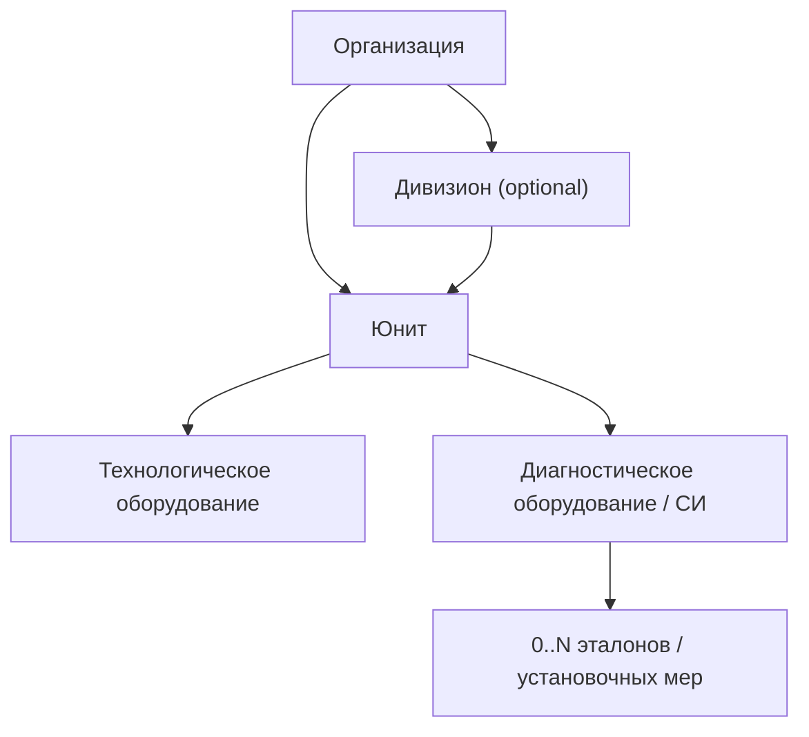

### 2.1. Организация

Организация является tenant-контейнером.

На старте обязательны только поля, без которых нельзя начать оргструктуру и вести оборудование:

- тип организации / ОПФ (`ООО`, `ПАО`, `НАО`, `ИП`);
- полное и сокращенное наименование;
- ИНН;
- КПП, кроме `ИП`;
- юридический адрес;
- основной контактный email;
- основной контактный телефон;
- логотип опционально.

Отдельным неблокирующим блоком живут реквизиты и документы:

- почтовый адрес;
- ОГРН / ОГРНИП;
- расчетный счет;
- банк;
- корреспондентский счет;
- БИК;
- ФИО руководителя;
- должность руководителя;
- основание полномочий;
- файлы документов.

Логотип хранится отдельно от Postgres: таблица организации содержит только object key и metadata, а файл лежит в приватном S3-compatible bucket.

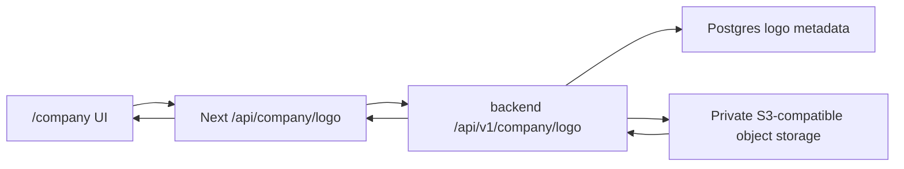

### 2.2. Дивизион

В модели используется единый пользовательский термин `дивизион`, а API/storage термин для нового Stage 03 contract — `division`. Это организационный уровень, который в пользовательских текстах всегда называется дивизионом, но пользовательский selector `Тип` для division не вводится.

Обязательные атрибуты:

- наименование;
- регион;
- адрес;
- руководитель;
- контакты;
- статус `active` / `archived`.

Storage поле `auth_divisions.division_type` остается скрытым compatibility default `division`; бизнес-классификация дивизионов не выбирается пользователем в этом slice.

### 2.3. Юнит

Юнит является primary operational scope для оборудования, заявок и доступа.

Обязательные правила:

- юнит может иметь родительский дивизион, но он не обязателен;
- сценарий `organization -> unit` должен поддерживаться так же, как `organization -> division -> unit`;
- оборудование живет в контексте юнита, а не только организации в целом.

Минимальные поля:

- тип юнита;
- родительская организация;
- родительский дивизион опционален;
- наименование;
- адрес;
- ответственный;
- контакты;
- статус;
- комментарий.

### 2.4. Управление оргструктурой

Оргструктура является постоянным master-data контуром, а не результатом одноразового запуска.

Требования:

- `/company` должен показывать дерево организации: дивизионы, прямые юниты организации и юниты внутри дивизионов;
- organization-scope admin может создавать первый и последующие узлы из одного и того же UI;
- narrower scopes видят только свой subtree и не получают mutate actions для broader organization graph;
- archive применяется вместо physical delete для дивизионов и юнитов;
- перед архивированием узла UI/API должны показать blocking dependencies, если под ним есть active equipment, active scoped grants или другие master-data references;
- equipment, MI, standards, contracts и employee grants должны ссылаться только на visible active scopes при создании новых записей.

## 3. Пользователи, membership и доступ

Stage 03 разделяет три разных сущности:

1. `Account` — кто человек как пользователь платформы;
2. `Membership` — состоит ли он в конкретной организации;
3. `Scoped grant` — что он может делать и в какой области действия.

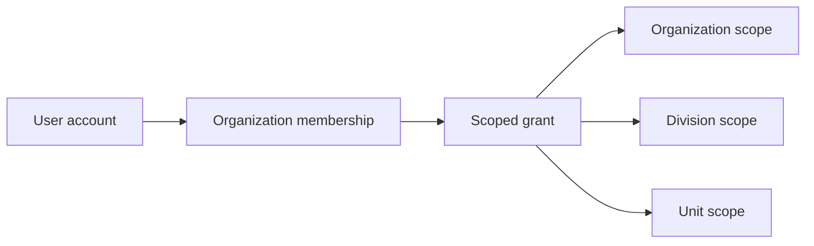

### 3.1. Scoped access

Грант доступа описывается комбинацией:

- шаблон роли;
- область действия;
- набор позитивных разрешений.

MVP-модель прав:

- scope `organization` действует на всю иерархию ниже;
- scope `division` действует на дочерние юниты;
- scope `unit` действует только на конкретный юнит;
- deny-layer в MVP не вводится;
- права суммируются, а не конфликтуют между собой.

Канонический role catalog для текущего Stage 03 v1:

| Role template | Пользовательский смысл | Допустимый scope | Stage 03 mutate capability |
| --- | --- | --- | --- |
| `organization_admin` | Администратор организации | `organization` | Да: `manage_structure`, `manage_access`, `manage_contracts`, `manage_equipment`, `manage_employees`; также `view_employees` |
| `organization_head` | Руководитель организации | `organization` | Нет, read-only; `view_employees` на всю организацию |
| `division_admin` | Администратор дивизиона | `division` | Да в пределах своего дивизиона и дочерних юнитов: `manage_structure`, `manage_access`, `manage_contracts`, `manage_equipment`, `manage_employees`; также `view_employees` |
| `division_head` | Руководитель дивизиона | `division` | Нет, read-only; `view_employees` по дивизиону и дочерним юнитам |
| `division_operator` | Сотрудник дивизиона | `division` | Нет, read-only |
| `unit_admin` | Администратор юнита | `unit` | Да в пределах своего юнита: `manage_structure`, `manage_access`, `manage_contracts`, `manage_equipment`, `manage_employees`; также `view_employees` |
| `unit_head` | Руководитель юнита | `unit` | Нет, read-only; `view_employees` по своему юниту |
| `unit_operator` | Сотрудник юнита | `unit` | Нет, read-only |
| `auditor` | Аудитор | `organization`, `division` или `unit` | Нет, read-only; `view_employees` в пределах своего scope |

Legacy aliases are handled only by the DB cutover migration and are not a public API of the current contract:

- the old read-only viewer role is now represented only by `auditor`;
- the old division-manager role is now represented only by `division_head`;
- previous unit-admin semantics from early Stage 03 are now represented by `unit_head`; current `unit_admin` is a scoped admin role;
- current `unit_operator` means a unit employee, not a unit administrator.

В v1 mutation-права разделены по области: `organization_admin` управляет всей организацией и профилем организации; `division_admin` управляет доступом, сотрудниками, договорами, оборудованием, своим дивизионом и дочерними юнитами; `unit_admin` управляет доступом, сотрудниками, договорами, оборудованием и своей карточкой юнита. Профиль организации остается только за `organization_admin`.

### 3.1.1. Просмотр и управление сотрудниками

Активный сотрудник в registry — это `auth_membership` со статусом `active` и связанный `auth_scoped_grant`. Pending invites остаются отдельным lifecycle и не считаются активными сотрудниками до acceptance.

Visibility для `GET /employees` строится от текущего explicit grant:

- `organization` scope видит все active employee access rows организации;
- `division` scope видит сотрудников, назначенных напрямую на дивизион, и сотрудников дочерних юнитов;
- `unit` scope видит только сотрудников своего юнита;
- organization-scope сотрудники не раскрываются в division/unit scoped списках;
- `division_operator` и `unit_operator` не получают вкладку сотрудников.

Scoped admins с capability `manage_employees` могут менять role/scope активного сотрудника через `PATCH /employees/{accessID}` и отключать сотрудника через `POST /employees/{accessID}/deactivate` только внутри visible scope/subtree. Update проходит ту же role/scope compatibility и active visible target validation, что invite creation; division/unit admins не могут назначать organization-scope access. Self-edit и self-deactivate текущего session grant запрещены. Deactivation архивирует membership и инвалидирует active sessions этого membership; restore UI в текущем slice отсутствует.

### 3.2. Приглашения сотрудников

Flow приглашения сотрудника:

1. админ выбирает `Пригласить сотрудника`;
2. задает email, ФИО, должность, шаблон роли, scope и срок жизни ссылки;
3. система отправляет письмо;
4. сотрудник принимает приглашение;
5. дозаполняет профиль;
6. видит только свой контур доступа.

Статусы приглашения:

- `draft`
- `sent`
- `opened`
- `accepted`
- `expired`
- `revoked`

### 3.2.1. Реализованный slice-002 contract

Во втором живом Stage 03 slice employee invite flow зафиксирован следующим контрактом:

- admins с `manage_access` могут создавать draft employee invite после active session только в пределах visible scope/subtree; organization-scope invite доступен только `organization_admin`, а division/unit-scope invite требует существующий visible active target scope;
- `POST /employee-invites` создает `draft` с `full_name`, `email`, `role_template`, `scope_type`, `scope_id` и `expires_at`;
- `POST /employee-invites/{inviteID}/send` выпускает одноразовый token и переводит invite в `sent`;
- `GET /invites/{token}` используется как общий public invite endpoint для first-admin и employee flow, а employee invite при первом открытии переводится из `sent` в `opened`;
- `POST /invites/{token}/accept` создает или связывает account, поднимает organization membership, upsert-ит scoped grant и возвращает session;
- `POST /employee-invites/{inviteID}/revoke` закрывает `draft` / `sent` / `opened` invite со статусом `revoked`;
- повторный `accept` по уже использованному employee token возвращает конфликт и не создает вторую membership/session side effect.

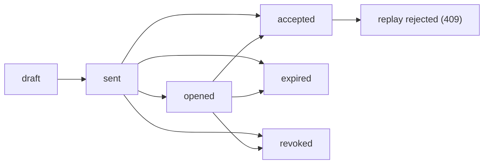

## 4. Навигация и рабочие пространства

Навигация строится вокруг выбора контекста:

- `Организация` — обзор всех дивизионов, юнитов и оборудования организации;
- `Дивизион` — обзор только своего поддерева и всех его юнитов;
- `Юнит` — основной operational workspace для оборудования, СИ, эталонов и связанных действий.

Главные экраны:

- организация: сводка по оборудованию, сотрудникам, договорам и структуре;
- дивизион: сводка по юнитам и оборудованию внутри дивизиона;
- юнит: рабочее место со списком оборудования, СИ, эталонов и точками входа в CRUD.

### 4.1. Реализованная workspace projection для slice-002

Session summary в slice-002+ больше не возвращает только organization-wide contour, а проецирует singular runtime workspace прямо из explicit active scoped grant:

- `organization` scope открывает весь org graph ниже, показывает вкладку `Сотрудники` для `organization_admin`, `organization_head` и organization-scope `auditor`, а employee invites / edit / deactivate доступны `organization_admin`;
- `division` scope открывает целевой дивизион и его дочерние юниты, но не wider organization contour;
- `division_admin` получает mutate controls только для своего дивизиона, дочерних юнитов, access/employees/equipment/contracts внутри subtree и не может редактировать профиль организации;
- `division_head` и division-scope `auditor` получают read-only вкладку `Сотрудники` только по своему дивизиону и дочерним юнитам;
- `unit` scope открывает только один целевой юнит и не раскрывает division/organization graph вверх;
- `unit_admin` получает mutate controls только для своего юнита и access/employees/equipment/contracts внутри него;
- `unit_head` и unit-scope `auditor` получают read-only вкладку `Сотрудники` только по своему юниту;
- один и тот же `/company` route используется как scoped landing page после invite acceptance и последующего login;
- session restore не выбирает новый workspace: он использует сохраненный `grant_id`;
- если direct login находит несколько eligible memberships/grants, backend возвращает truthful `409`, а не silently выбирает первый доступ.

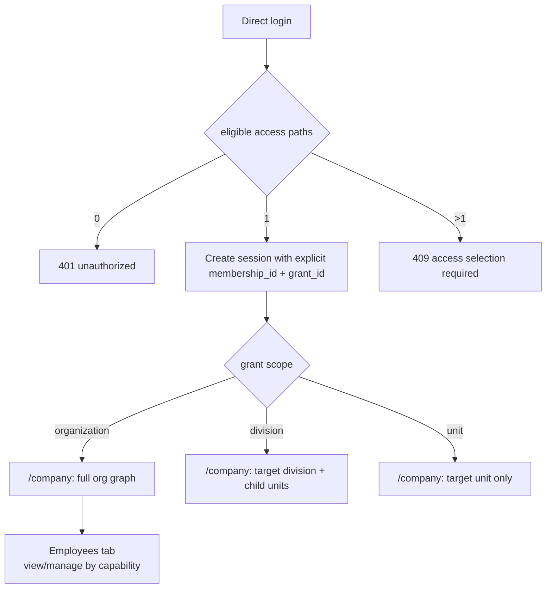

### 4.2. Реализованный contracts + workspace contour для slice-003

Третий живой Stage 03 slice добавляет поверх того же identity baseline реальный contracts/workspace layer:

- customer `organization_admin` на organization scope управляет contracts registry на публичном route `/contracts`;
- backend resource naming может оставаться `/agreements`, но только как explicit adapter boundary под web route handlers `/api/contracts*`;
- минимальный contract status baseline зафиксирован как `inactive`, `active`, `expired`;
- routing eligibility для будущего Stage 04 request flow считается только для `active` contract внутри своего date window;
- routing resolve использует contract context (`unit`, `work type`, `equipment type`, `region`) и возвращает только допустимого contractor, а не поддерживает свободный manual choice;
- contractor organization после активного launch получает `workspace.landingPath = "/contracts"` и видит только customer contracts, привязанные к этой contractor organization;
- unrelated customer contracts остаются скрыты для contractor contour, а customer session не расширяется в contractor workspace.

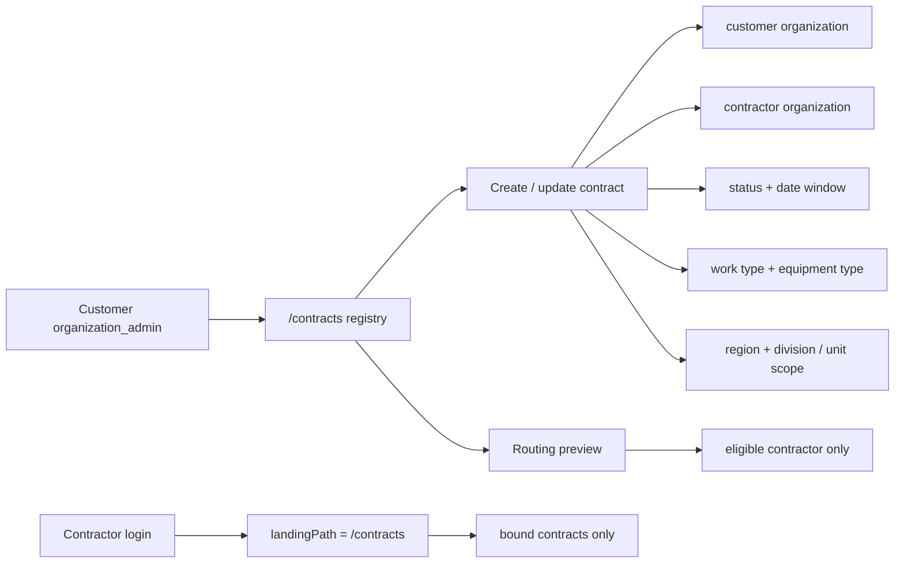

## 5. Оборудование, СИ и эталоны

### 5.0. Product correction 2026-05-11: диагностическое оборудование заказчика

После встречи с заказчиком термин `средство измерения` в VRK нужно трактовать уже, чем прежняя обобщенная модель:

- `СИ` в MVP — это диагностическое оборудование заказчика, которым на вагоноремонтном предприятии проверяют качество ремонта или состояние узлов вагона: колесных пар, буксовых узлов, тормозов, подшипников и т.д.;
- это не оборудование подрядчика и не отдельный контур метрологического оборудования аккредитованной организации;
- технологическое оборудование и диагностическое оборудование являются customer-side equipment master data внутри юнита;
- contractor-side метрологическое оборудование и эталоны аккредитованной организации остаются вне MVP и могут появиться отдельным контуром позже.

Ключевая модель связи меняется с прежнего reusable many-to-many допущения на customer-side комплект:

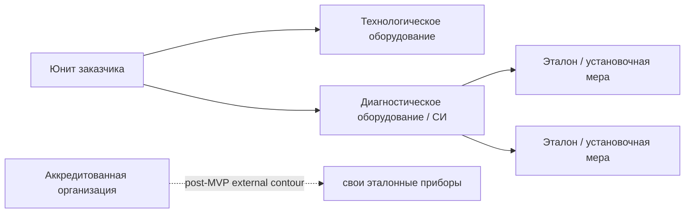

Эта диаграмма фиксирует target contract после уточнения: у одного диагностического оборудования может быть несколько эталонов, а эталон в MVP принадлежит комплекту конкретного диагностического оборудования. Эталонный манометр, частотомер и другое оборудование, которое привозит внешний метролог для официальной поверки, не заводится как customer-side equipment в первой версии.

### 5.1. Оборудование

Оборудование создается из единой формы `Новое оборудование` с обязательным типом. В пользовательской модели нужно различать:

- технологическое оборудование — стенды, установки, оборудование цехов и другие объекты производственного/ремонтного процесса;
- диагностическое оборудование / СИ — оборудование заказчика для проверки качества ремонта или состояния узлов, включая простые инструменты и сложные приборы вроде Robocon, УКВР и приборов ЖТ.

Общие минимальные поля:

- тип оборудования: `Техническое` / `Диагностическое`;
- статус;
- юнит;
- документы;
- комментарий.

Для технологического оборудования:

- производитель;
- классификация;
- модель;
- полное наименование;
- заводской номер;
- инвентарный номер;
- год выпуска.

Для диагностического оборудования:

- наименование / тип / модель;
- ФИФ / регистрационный номер;
- серийный номер;
- опциональная связь с технологическим оборудованием;
- `0..N` эталонов / установочных мер внутри той же формы.

После создания карточки технологическое оборудование может жить без метрологии, если она не нужна. Диагностическое оборудование должно иметь метрологический статус и журнал официальных операций, потому что его показания влияют на вывод `исправен / неисправен`.

### 5.2. Средства измерения

СИ являются диагностическим оборудованием заказчика. Текущий технический ресурс `measuring-instruments` допустим как implementation boundary, но пользовательский и продуктовый смысл — не "самостоятельный класс оборудования подрядчика", а customer-side diagnostic equipment внутри юнита.

Минимальные поля:

- наименование / тип / модель;
- регистрационный номер;
- заводской номер;
- статус;
- владелец / юнит;
- связь с технологическим оборудованием, если диагностическое оборудование обслуживает конкретную карточку;
- метрологический статус, рассчитанный по журналу официальных операций.

### 5.3. Эталоны

Эталон / установочная мера — объект из комплекта диагностического оборудования, который используется для настройки или проверки прибора: эталонное кольцо, пробка, скоба и т.п.

Важное разграничение:

- рабочая настройка прибора на своем эталоне не является официальной поверкой и обычно не требует ручной записи пользователем в VRK;
- официальная поверка аккредитованной организацией фиксируется через журнал операции, протокол и организацию-исполнителя;
- эталоны внешней аккредитованной организации не заводятся в MVP как customer-side реестр.

Минимальные поля:

- тип / модель;
- идентификатор / серийный номер;
- метрологические характеристики;
- родительское диагностическое оборудование / СИ;
- статус;
- документы.

### 5.4. Журналы операций

Для оборудования источником правды по официальным операциям является единый журнал операций по оборудованию, а не только пара дат в карточке.

Запись журнала хранит:

- вид операции;
- номер документа;
- дата операции;
- `действует до`;
- организацию-исполнителя;
- вложение;
- комментарий.

Правило расчета для диагностического оборудования:

- текущий статус и ближайшая дата рассчитываются из последней действующей записи журнала оборудования;
- денормализованные поля на карточке допустимы как cache/view-model, но не как единственный источник правды.

### 5.5. Связи между оборудованием, СИ и эталонами

Stage 03 больше не должен проектироваться вокруг reusable many-to-many связи между СИ и эталонами как целевой модели.

Целевая модель после product correction:

- у юнита может быть `0..N` технологических единиц оборудования;
- у юнита может быть `0..N` единиц диагностического оборудования / СИ;
- диагностическое оборудование может быть связано с технологическим оборудованием, если оно применяется для конкретного объекта контроля;
- у диагностического оборудования может быть `0..N` эталонов / установочных мер;
- эталон в MVP принадлежит одному диагностическому оборудованию и не переиспользуется как свободный общий справочник между несколькими СИ.

Связь допускается:

- через parent foreign key `standard -> diagnostic equipment`;
- через журнал официальных метрологических операций для поверки/калибровки/приостановки/вывода.

### 5.6. Реализованный slice-004 registry contract

Исторический slice-004 доказывает прежний registry baseline. После product correction 2026-05-11 он остается важным implementation floor, но не является финальным target contract для следующей итерации оборудования.

В четвертом живом Stage 03 slice registry layer зафиксирован следующим контрактом:

- customer-side public contour остается на одном route `/equipment`;
- внутри route работают три отдельные registry surfaces:
  - equipment;
  - measuring instruments;
  - standards;
- анонимный пользователь видит truthful shell без live data;
- customer `organization_admin` на organization scope может создавать записи во всех трех registries;
- division-scope и unit-scope пользователи работают на том же route, но только в read-only contour и без broader organization leak;
- historical backend protected endpoints for the original slice-004 registry floor были отдельными ресурсами, а не одной mega-form:
  - `GET/POST /equipment`
  - `GET/POST /measuring-instruments`
  - legacy standalone standards registry endpoints, retired from the current target contract;
- equipment может существовать без обязательных metrology attachments;
- measuring instrument может быть `standalone` либо `built_in` к equipment;
- historical standard остается самостоятельным reusable record и может быть связан более чем с одним measuring instrument, но это допущение должно быть заменено в следующем equipment-domain correction slice.

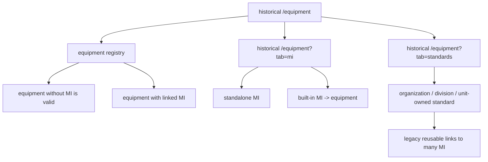

### 5.7. Реализованный slice-005 journal + archive contract

Пятый живой Stage 03 slice не создает новый public route family, а расширяет тот же `/equipment` contour:

- historical page state used tab query values for equipment, measuring instruments and standards;
- `archived=1` включает explicit archive visibility на том же route;
- web route handlers остаются под `app/api/equipment*` и проксируют browser к backend journal/archive endpoints без раскрытия internal host;
- paginated registry list responses сохраняют envelope `meta` на web boundary, чтобы `/equipment` contour мог truthfully видеть `total/limit/offset`, а не только текущий `data` slice;
- historical protected backend contract для slice-005 добавлял:
  - `GET/POST /measuring-instruments/{id}/journals`;
  - `POST /equipment/{id}/archive`;
  - `POST /measuring-instruments/{id}/archive`;
- removed by equipment-domain correction 2026-05-11:
  - standalone standard journal endpoints;
  - standalone standard archive endpoint;
- journal entry хранит:
  - `operationType`;
  - `operationDate`;
  - `documentNumber`;
  - `validUntil`;
  - `executorOrganization`;
  - `attachmentUrl`;
  - `comment`;
- archived state не подменяет derived status:
  - запись остается в persistence с `archived_at`;
  - default active lists и active relation pickers ее не показывают;
  - explicit archive view показывает ту же запись и ее read-only history;
  - archived СИ и archived standards отклоняют новые journal mutations.

Current derived-state rule в repo реализован минимально и явно:

- если journal history пустая, API возвращает fallback status из карточки;
- иначе берется latest journal entry с ordering `operation_date DESC, created_at DESC`;
- `decommission` делает subject `retired`;
- `suspension` делает subject `inactive`;
- `verification`, `calibration`, `maintenance` делают subject `active`;
- если у latest entry есть `validUntil` и дата уже в прошлом по UTC, derived status понижается до `inactive`;
- `nextDueDate` для ответа берется из `latest.validUntil`, если оно задано.

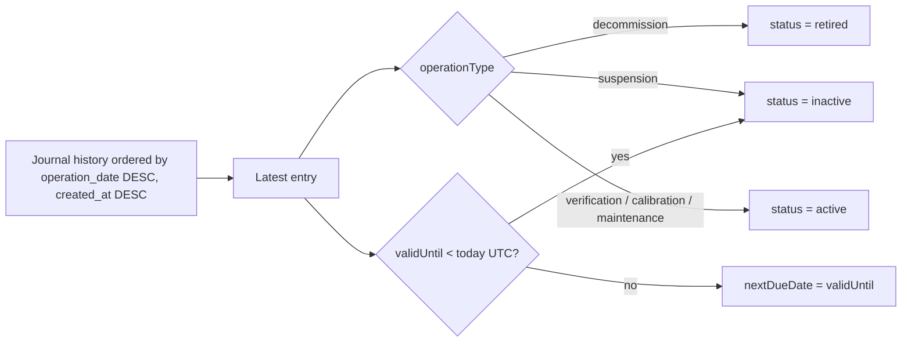

Диаграмма фиксирует текущий slice-005 derivation contract: archived state хранится отдельно, а текущий metrology status и ближайшая дата вычисляются по latest applicable journal record.

### 5.8. Target correction: unified equipment workspace

Equipment-domain correction moves the user-facing contract from three tabbed registries to one workspace:

- public route remains `/equipment`;
- old query params `tab=mi` and `tab=standards` are compatibility-only and must not expose separate active surfaces;
- UI title is `Оборудование`;
- create surface is one form `Новое оборудование` with required type `Техническое` / `Диагностическое`;
- list surface is `Оборудование в учете`;
- technical cards show ordinary equipment data and lifecycle state;
- diagnostic cards show diagnostic fields, ФИФ/serial data, owned standards count and standards list inside the card;
- standards are not created or viewed as a standalone reusable registry in the target UI;
- current API no longer exposes a standalone `/standards` list/get/update/archive registry; creating an owned standard is nested under its diagnostic parent via `POST /measuring-instruments/{id}/standards`;
- customer admins can manage the owned kit from the diagnostic equipment edit modal: newly added standards are created on save, and removed standards are physically deleted through `DELETE /measuring-instruments/{id}/standards/{standardId}` rather than archived or detached;
- hard-deleting an owned standard also removes legacy standard-journal rows for that standard; the target product keeps the journal at the equipment/diagnostic-equipment level;
- journal surface is `Журнал операций по оборудованию`;
- no separate standard journal is exposed in the target UI.

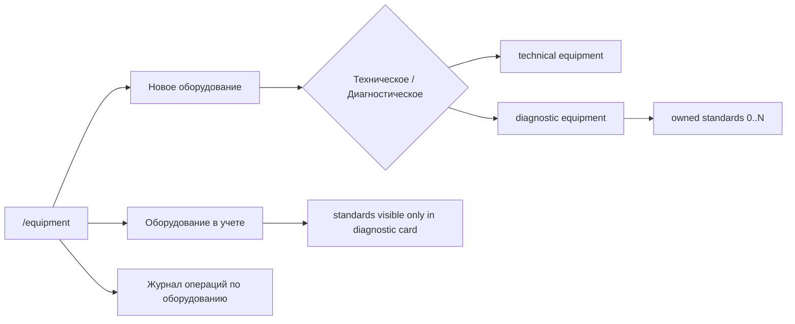

Эта диаграмма является target source of truth для Stage 03 correction: historical backend resources may remain as compatibility implementation detail, but product behavior is equipment -> owned standards -> equipment journal.

Migration `000016_equipment_domain_correction` makes the legacy data truthful for this contract:

- active standards with one legacy diagnostic-equipment link receive that diagnostic parent;
- active standards linked to several diagnostic equipment records are copied per diagnostic parent, so no current child standard is reused across cards;
- active standards without a derivable diagnostic parent are archived with a migration comment instead of staying visible as standalone current records;
- unarchived standards are constrained to have `diagnostic_equipment_id`, while archived historical rows may remain as read-only compatibility data.

## 6. Исторические ownership labels и lifecycle rules

Текущий proven Stage 03 contract не вводит отдельный CRUD-модуль для organization-scoped dictionaries с local drafts. Для historical slice-005 standards были реализованы через ownership labels:

Вместо этого реализовано более узкое и документированное решение:

- стандарт хранит ownership scope как `organization`, `division` или `unit`;
- вместе со scope хранится `ownerLabel`, который по умолчанию наследуется от видимого organization / division / unit name;
- UI может явно переопределить label для читаемого представления владельца, но это не отдельная dictionary family;
- справочники вроде производителей, классификаций и типов пока остаются текстовыми или seeded boundaries и не доказаны как самостоятельный Stage 03 CRUD contour.

Это ограничение было намеренным для slice-005: он закрывал journal/archive truth и doc-sync, а не расширял Stage 03 в parallel dictionary module.

После product correction 2026-05-11 ownership labels больше не являются целевым способом владения эталоном. Equipment-domain correction заменяет их parent relation к диагностическому оборудованию, сохраняя archive/history правила.

## 7. Архивирование и явные non-goals

Ключевые сущности не удаляются физически:

- организация;
- дивизион;
- юнит;
- пользователь;
- договор;
- оборудование;
- средство измерения;
- эталон.

Для MVP сознательно откладываются:

- Яндекс ID как обязательный путь входа;
- 2FA;
- массовый Excel import;
- ручная сборка кастомных ролей по чекбоксам;
- сложные уведомления и напоминания;
- автосоздание оргструктуры из внешних систем;
- standalone org-scoped dictionary/local-draft CRUD module поверх Stage 03 master-data contour;
- отдельный самостоятельный метрологический модуль вне master-data contour.
