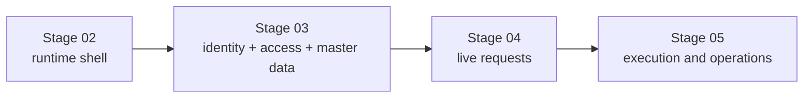
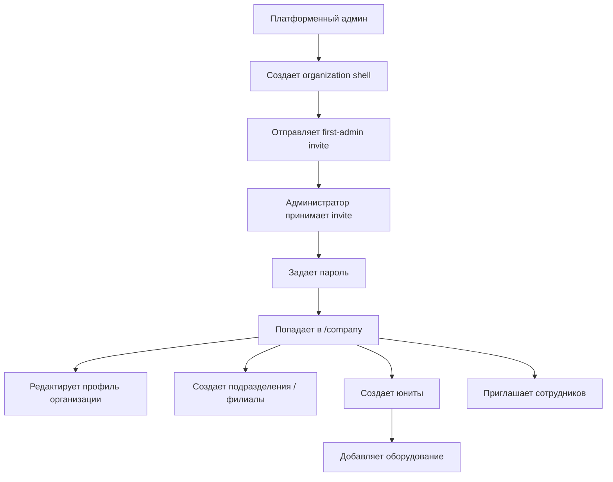
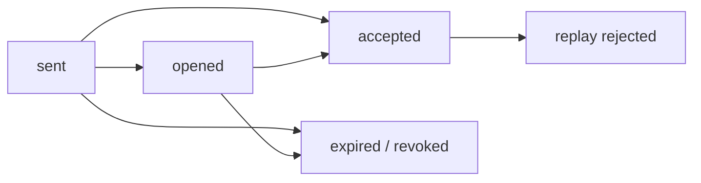
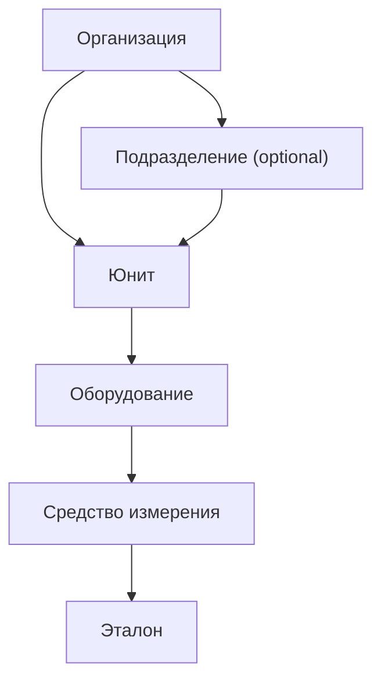
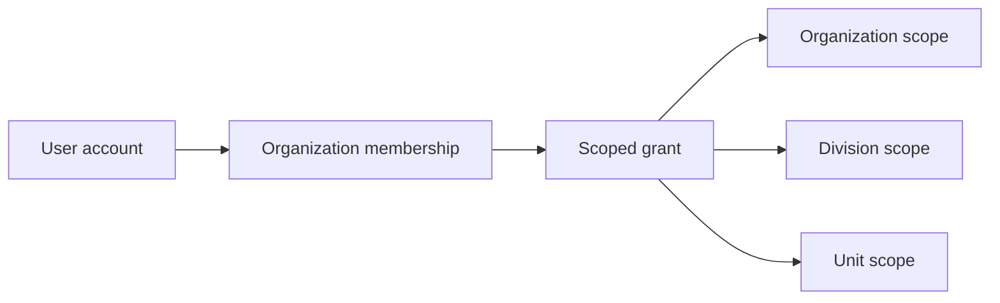
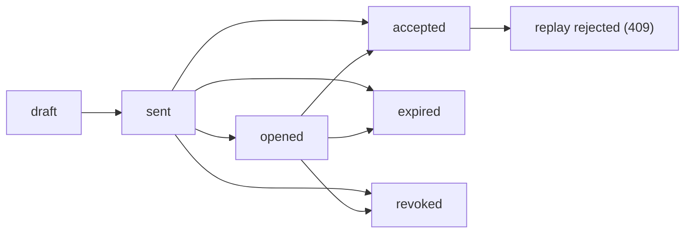
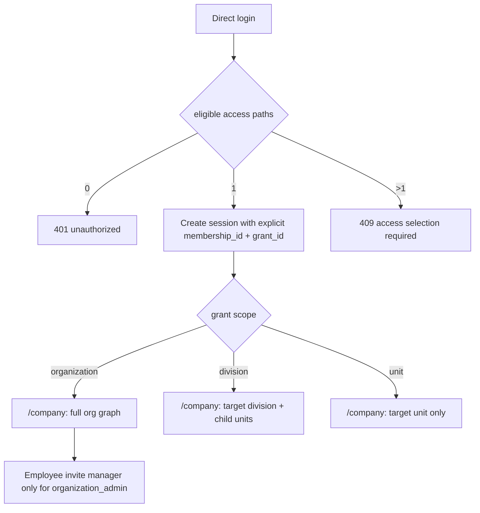
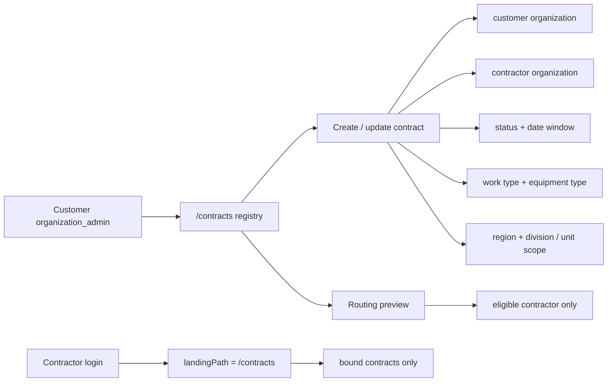
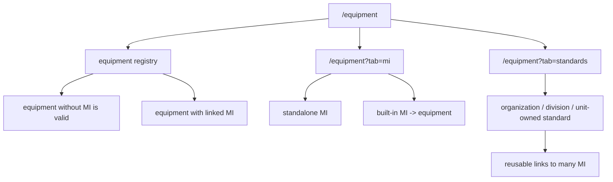
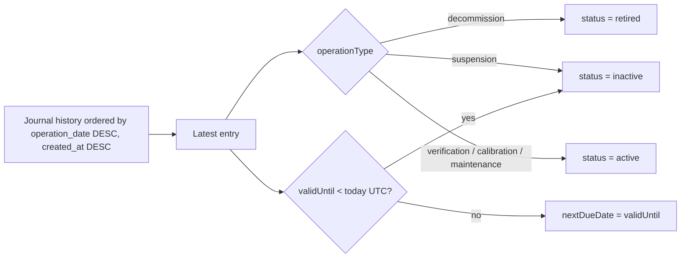

# Identity, Access, and Master Data

Статус: accepted baseline  
Обновлено: 2026-04-29

## Назначение

Этот документ фиксирует каноническую доменную модель для `Stage 03` в VRK:

- активация первого администратора организации;
- иерархия `организация -> подразделение -> юнит`;
- сотрудники, приглашения, membership и scoped access;
- master-data контур для договоров, оборудования, СИ и эталонов;
- правила архивирования и bounded ownership labels.

Это не замена `docs/roadmap.md`, а более узкий source of truth для решений, которые уже не помещаются в короткое stage summary.

## Смежные документы

- roadmap и stage boundaries: [`docs/roadmap.md`](../roadmap.md)
- product scope: [`docs/PRD-MVP.md`](../PRD-MVP.md)
- web flow mapping: [`docs/design/customer-admin-bootstrap-flow.md`](../design/customer-admin-bootstrap-flow.md)
- frontend growth path: [`docs/architecture/frontend-architecture.md`](./frontend-architecture.md)
- stage artifacts: [`.agent/stages/03-identity-master-data/`](../../.agent/stages/03-identity-master-data/)

## Граница stage-ов

`Stage 02` поднимает только runtime shell и truthful placeholders.  
`Stage 03` включает реальную доменную активацию.  
`Stage 04` начинает живой request contour на уже существующем master-data слое.

## 1. Активация организации и первого администратора

Основной сценарий запуска организации:

1. платформенный админ создает заготовку организации;
2. указывает email первого администратора;
3. система отправляет одноразовое приглашение;
4. пользователь открывает ссылку, задает пароль;
5. после входа попадает в постоянный `/company` contour организации.

Решения:

- основной путь: `invite link + password setup`;
- ручная раздача логина/пароля не используется как основной сценарий;
- внешний вход вроде Яндекс ID допустим позже как дополнительный путь после открытия приглашения, но не как замена invite acceptance в MVP;
- `invite code` допустим только как резервный offline-friendly сценарий;
- после активации пользователь не попадает в пустой кабинет или одноразовый wizard, а в рабочий кабинет организации с management actions;
- создание первого подразделения/филиала и первого юнита является частным случаем постоянного UI управления оргструктурой.

### 1.1. Historical slice-001 contract

В первом живом Stage 03 slice этот сценарий был реализован через launch wizard. Это исторический proof текущей реализации, но продуктовый target от 2026-04-29 заменяет wizard на постоянный `/company` management surface:

- `POST /platform/organization-shells` создает `organization shell` и first-admin invite, но только за deployment-scoped platform-admin boundary;
- публичный `/register` не вызывает backend напрямую: Next route handler inject-ит `X-VRK-Platform-Admin-Secret` server-side, а browser не получает secret;
- `GET /first-admin-invites/{token}` открывает одноразовую ссылку и переводит invite из `sent` в `opened`;
- `POST /first-admin-invites/{token}/accept` задает пароль, создает `membership`, выдает initial `organization_admin` grant и возвращает session;
- повторный `accept` по тому же token возвращает конфликт и не может создать вторую активацию;
- `POST /launch-wizard` сохраняет core organization data и поддерживает оба пути: `organization -> division -> unit` и `organization -> unit`;
- `POST /sessions` и `GET /sessions/current` позволяют вернуться только в тот contour, который привязан к explicit active `membership_id + grant_id`;
- direct login с несколькими eligible access paths возвращает `409` и не делает silent selection.

### 1.2. Target correction: organization structure management UI

Следующий Stage 03 correction slice должен убрать зависимость бизнес-логики от "завершенного wizard":

- first-admin invite acceptance сразу выпускает session и ведет администратора на `/company`;
- `/company` показывает empty / partial / populated states организации и не требует отдельного `/company/setup`;
- organization-scope admin может в любое время создавать, редактировать и архивировать подразделения/филиалы и юниты;
- создание первого подразделения и первого юнита использует те же API и UI, что и создание последующих узлов;
- юнит может быть создан под подразделением или напрямую под организацией;
- organization-scope employee invite доступен active organization admin без wizard gate;
- division/unit-scope employee invite требует существующий visible target scope.

#### 1.2.1. `/company` business-field contract

Для correction slice `slice-010-stage03-org-structure-management` формы профиля организации, подразделения/филиала и юнита используют разделенный field contract:

| Поле | Канонический контракт |
| --- | --- |
| `propertyType` / organization `type` alias | В профиле организации visible selector `Тип` хранит юридическую форму: `ООО`, `АО`, `ПАО`. `type` остается compatibility alias в API/session там, где старые клиенты уже читают это поле. Legacy input `ОАО` нормализуется в `ПАО`, `ЗАО` в `АО`, `LLC` в `ООО`; `ОАО` и `ЗАО` не показываются как актуальные options, потому что модель ОАО/ЗАО заменена публичными/непубличными АО. |
| division `type` | Не является user-facing бизнес-полем и не показывается selector-ом в `/company`. Storage column `auth_divisions.division_type` остается `NOT NULL` для совместимости с sqlc/generated response shape; новые create/update writes используют скрытый internal default `division`. |
| unit `type` | Selector frozen for this slice: `ВРД`, `ВРЗ`, `ВУ`, `ВРП`. Эти значения применяются только к unit create/edit forms; Stage 04 не добавляет сюда request-типы. |
| `name` | Каноническое отображаемое имя организации, подразделения/филиала или юнита. |
| `registeredAddress` | Канонический адрес организации. Для organization profile новые записи и редактирование должны опираться на это поле. |
| `address` | Compatibility/display alias там, где division/unit storage, API payload или старые данные все еще используют `address`; не заменяет `registeredAddress` как канонический адрес организации. |
| `leaderFullName` | Каноническое display-поле руководителя. |
| `managerName` | Migration/read-display compatibility alias для старых stored/session payloads; новые leader semantics должны мапиться в `leaderFullName`. |
| `leaderPosition` | Должность руководителя для карточек организации, подразделения/филиала и юнита, где этот record type ее несет. |
| `contractPhone` | Договорной/контактный телефон record-а, где он нужен текущему `/company` management surface. |
| `contractEmail` | Договорной/контактный email record-а, где он нужен текущему `/company` management surface. |
| `actingBasis` | Основание полномочий руководителя для record-а, где это поле применимо. |
| `code`, `region`, `status`, `comment` | Сохраняются и отображаются там, где текущие backend/session/UI contracts продолжают их использовать. |

Active create/select flows должны выбирать только visible active scopes. Archived подразделения и юниты скрываются из default selection, не удаляются физически и могут вернуть truthful blocking error, если active equipment, active scoped grants или другие Stage 03 references не позволяют безопасно архивировать узел.

Source note for organization legal forms: the visible MVP set intentionally uses `ООО`, `АО`, `ПАО`. `ОАО` and `ЗАО` stay compatibility aliases because [ФНС describes](https://www.nalog.gov.ru/rn03/news/tax_doc_news/5096254/) the abolition of open/closed JSC split in favor of public/non-public JSCs, and OKOPF keeps current entries for [ПАО](https://classifikators.ru/okopf/12247), [АО](https://classifikators.ru/okopf/12267), and [ООО](https://classifikators.ru/okopf/12300).

## 2. Иерархия объектов

Базовая operational chain для Stage 03:

### 2.1. Организация

Организация является tenant-контейнером.

На старте обязательны только поля, без которых нельзя начать оргструктуру и вести оборудование:

- тип организации / ОПФ;
- полное и сокращенное наименование;
- ИНН;
- КПП;
- юридический адрес;
- основной контактный email;
- основной контактный телефон;
- логотип опционально.

Отдельным неблокирующим блоком живут реквизиты и документы:

- почтовый адрес;
- ОГРН;
- ОКПО;
- ФИО руководителя;
- должность руководителя;
- основание полномочий;
- файлы документов.

### 2.2. Подразделение

В модели используется единый пользовательский термин `подразделение`, а API/storage термин для нового Stage 03 contract — `division`. Это может быть филиал, подразделение или иной организационный уровень, но пользовательский selector `Тип` для division не вводится.

Обязательные атрибуты:

- наименование;
- код;
- регион;
- адрес;
- руководитель;
- контакты;
- статус `active` / `archived`.

Storage поле `auth_divisions.division_type` остается скрытым compatibility default `division`; бизнес-классификация подразделений/филиалов не выбирается пользователем в этом slice.

### 2.3. Юнит

Юнит является primary operational scope для оборудования, заявок и доступа.

Обязательные правила:

- юнит может иметь родительское подразделение, но оно не обязательно;
- сценарий `organization -> unit` должен поддерживаться так же, как `organization -> division -> unit`;
- оборудование живет в контексте юнита, а не только организации в целом.

Минимальные поля:

- тип юнита;
- родительская организация;
- родительское подразделение опционально;
- наименование;
- код;
- адрес;
- ответственный;
- контакты;
- статус;
- комментарий.

### 2.4. Управление оргструктурой

Оргструктура является постоянным master-data контуром, а не результатом одноразового запуска.

Требования:

- `/company` должен показывать дерево организации: подразделения/филиалы, прямые юниты организации и юниты внутри подразделений;
- organization-scope admin может создавать первый и последующие узлы из одного и того же UI;
- narrower scopes видят только свой subtree и не получают mutate actions для broader organization graph;
- archive применяется вместо physical delete для подразделений и юнитов;
- перед архивированием узла UI/API должны показать blocking dependencies, если под ним есть active equipment, active scoped grants или другие master-data references;
- equipment, MI, standards, contracts и employee grants должны ссылаться только на visible active scopes при создании новых записей.

## 3. Пользователи, membership и доступ

Stage 03 разделяет три разных сущности:

1. `Account` — кто человек как пользователь платформы;
2. `Membership` — состоит ли он в конкретной организации;
3. `Scoped grant` — что он может делать и в какой области действия.

### 3.1. Scoped access

Грант доступа описывается комбинацией:

- шаблон роли;
- область действия;
- набор позитивных разрешений.

MVP-модель прав:

- scope `organization` действует на всю иерархию ниже;
- scope `division` действует на дочерние юниты;
- scope `unit` действует только на конкретный юнит;
- deny-layer в MVP не вводится;
- права суммируются, а не конфликтуют между собой.

Канонический role catalog для текущего Stage 03 v1:

| Role template | Пользовательский смысл | Допустимый scope | Stage 03 mutate capability |
| --- | --- | --- | --- |
| `organization_admin` | Администратор организации | `organization` | Да: `manage_structure`, `manage_access`, `manage_contracts`, `manage_equipment` |
| `organization_head` | Руководитель организации | `organization` | Нет, read-only |
| `division_head` | Руководитель подразделения | `division` | Нет, read-only |
| `division_operator` | Сотрудник подразделения | `division` | Нет, read-only |
| `unit_head` | Руководитель юнита | `unit` | Нет, read-only |
| `unit_operator` | Сотрудник юнита | `unit` | Нет, read-only |
| `auditor` | Аудитор | `organization`, `division` или `unit` | Нет, read-only |

Legacy aliases are handled only by the DB cutover migration and are not a public API of the current contract:

- the old read-only viewer role is now represented only by `auditor`;
- the old division-manager role is now represented only by `division_head`;
- previous unit-admin semantics are now represented by `unit_head`;
- current `unit_operator` means a unit employee, not a unit administrator.

В v1 фактические Stage 03 mutation-права остаются только у `organization_admin` на `organization` scope. Остальные роли уже участвуют в совместимости scope, session projection и read-only visibility, а операционные права для следующих stage-ов должны включаться через capability-map, без scattered string checks.

### 3.2. Приглашения сотрудников

Flow приглашения сотрудника:

1. админ выбирает `Пригласить сотрудника`;
2. задает email, ФИО, должность, шаблон роли, scope и срок жизни ссылки;
3. система отправляет письмо;
4. сотрудник принимает приглашение;
5. дозаполняет профиль;
6. видит только свой контур доступа.

Статусы приглашения:

- `draft`
- `sent`
- `opened`
- `accepted`
- `expired`
- `revoked`

### 3.2.1. Реализованный slice-002 contract

Во втором живом Stage 03 slice employee invite flow зафиксирован следующим контрактом:

- organization admin может создавать draft employee invite после active organization-scope session; division/unit-scope invite требует существующий visible target scope;
- `POST /employee-invites` создает `draft` с `full_name`, `email`, `role_template`, `scope_type`, `scope_id` и `expires_at`;
- `POST /employee-invites/{inviteID}/send` выпускает одноразовый token и переводит invite в `sent`;
- `GET /invites/{token}` используется как общий public invite endpoint для first-admin и employee flow, а employee invite при первом открытии переводится из `sent` в `opened`;
- `POST /invites/{token}/accept` создает или связывает account, поднимает organization membership, upsert-ит scoped grant и возвращает session;
- `POST /employee-invites/{inviteID}/revoke` закрывает `draft` / `sent` / `opened` invite со статусом `revoked`;
- повторный `accept` по уже использованному employee token возвращает конфликт и не создает вторую membership/session side effect.

## 4. Навигация и рабочие пространства

Навигация строится вокруг выбора контекста:

- `Организация` — обзор всех подразделений, юнитов и оборудования организации;
- `Подразделение` — обзор только своего поддерева и всех его юнитов;
- `Юнит` — основной operational workspace для оборудования, СИ, эталонов и связанных действий.

Главные экраны:

- организация: сводка по оборудованию, сотрудникам, договорам и структуре;
- подразделение: сводка по юнитам и оборудованию внутри подразделения;
- юнит: рабочее место со списком оборудования, СИ, эталонов и точками входа в CRUD.

### 4.1. Реализованная workspace projection для slice-002

Session summary в slice-002+ больше не возвращает только organization-wide contour, а проецирует singular runtime workspace прямо из explicit active scoped grant:

- `organization` scope открывает весь org graph ниже и позволяет управлять employee invites только при `organization_admin`;
- `division` scope открывает целевое подразделение и его дочерние юниты, но не wider organization contour;
- `unit` scope открывает только один целевой юнит и не раскрывает division/organization graph вверх;
- один и тот же `/company` route используется как scoped landing page после invite acceptance и последующего login;
- session restore не выбирает новый workspace: он использует сохраненный `grant_id`;
- если direct login находит несколько eligible memberships/grants, backend возвращает truthful `409`, а не silently выбирает первый доступ.

### 4.2. Реализованный contracts + workspace contour для slice-003

Третий живой Stage 03 slice добавляет поверх того же identity baseline реальный contracts/workspace layer:

- customer `organization_admin` на organization scope управляет contracts registry на публичном route `/contracts`;
- backend resource naming может оставаться `/agreements`, но только как explicit adapter boundary под web route handlers `/api/contracts*`;
- минимальный contract status baseline зафиксирован как `inactive`, `active`, `expired`;
- routing eligibility для будущего Stage 04 request flow считается только для `active` contract внутри своего date window;
- routing resolve использует contract context (`unit`, `work type`, `equipment type`, `region`) и возвращает только допустимого contractor, а не поддерживает свободный manual choice;
- contractor organization после активного launch получает `workspace.landingPath = "/contracts"` и видит только customer contracts, привязанные к этой contractor organization;
- unrelated customer contracts остаются скрыты для contractor contour, а customer session не расширяется в contractor workspace.

## 5. Оборудование, СИ и эталоны

### 5.1. Оборудование

Оборудование создается отдельной карточкой, без принудительной mega-form с метрологией.

Минимальные поля:

- производитель;
- классификация;
- модель;
- полное наименование;
- заводской номер;
- инвентарный номер;
- год выпуска;
- статус;
- юнит;
- документы;
- комментарий.

После создания карточки оборудование может жить без метрологии, если она не нужна.

### 5.2. Средства измерения

СИ являются отдельной сущностью, а не просто вложенным набором полей в оборудовании.

Минимальные поля:

- наименование / тип / модель;
- регистрационный номер;
- заводской номер;
- статус;
- владелец / юнит;
- признак `встроенное в оборудование` или `самостоятельное`.

### 5.3. Эталоны

Эталон является отдельным реестром.

Минимальные поля:

- тип / модель;
- идентификатор / серийный номер;
- метрологические характеристики;
- владелец;
- scope владения: юнит / подразделение / организация;
- статус;
- документы.

### 5.4. Журналы операций

Для СИ и эталонов источником правды является журнал метрологических операций, а не только пара дат в карточке.

Запись журнала хранит:

- вид операции;
- номер документа;
- дата операции;
- `действует до`;
- организацию-исполнителя;
- вложение;
- комментарий.

Правило расчета:

- текущий статус и ближайшая дата рассчитываются из последней действующей записи журнала;
- денормализованные поля на карточке допустимы как cache/view-model, но не как единственный источник правды.

### 5.5. Связи между оборудованием, СИ и эталонами

Stage 03 не использует жесткую связь `1:1` между СИ и эталоном.

Поддерживаемая модель:

- у оборудования может быть `0..N` СИ;
- у СИ может быть `0..N` эталонов;
- один эталон может повторно использоваться в нескольких операциях или для нескольких СИ.

Связь допускается:

- через таблицу назначений;
- через журнал операций.

### 5.6. Реализованный slice-004 registry contract

В четвертом живом Stage 03 slice registry layer зафиксирован следующим контрактом:

- customer-side public contour остается на одном route `/equipment`;
- внутри route работают три отдельные registry surfaces:
  - equipment;
  - measuring instruments;
  - standards;
- анонимный пользователь видит truthful shell без live data;
- customer `organization_admin` на organization scope может создавать записи во всех трех registries;
- division-scope и unit-scope пользователи работают на том же route, но только в read-only contour и без broader organization leak;
- backend protected endpoints для Stage 03 registries остаются отдельными ресурсами, а не одной mega-form:
  - `GET/POST /equipment`
  - `GET/POST /measuring-instruments`
  - `GET/POST /standards`;
- equipment может существовать без обязательных metrology attachments;
- measuring instrument может быть `standalone` либо `built_in` к equipment;
- standard остается самостоятельным reusable record и может быть связан более чем с одним measuring instrument.

### 5.7. Реализованный slice-005 journal + archive contract

Пятый живой Stage 03 slice не создает новый public route family, а расширяет тот же `/equipment` contour:

- page state остается URL-backed:
  - `tab=equipment | mi | standards`;
  - `archived=1` включает explicit archive visibility на том же route;
- web route handlers остаются под `app/api/equipment*` и проксируют browser к backend journal/archive endpoints без раскрытия internal host;
- paginated registry list responses сохраняют envelope `meta` на web boundary, чтобы `/equipment` contour мог truthfully видеть `total/limit/offset`, а не только текущий `data` slice;
- protected backend contract для slice-005 добавляет:
  - `GET/POST /measuring-instruments/{id}/journals`;
  - `GET/POST /standards/{id}/journals`;
  - `POST /equipment/{id}/archive`;
  - `POST /measuring-instruments/{id}/archive`;
  - `POST /standards/{id}/archive`;
- journal entry хранит:
  - `operationType`;
  - `operationDate`;
  - `documentNumber`;
  - `validUntil`;
  - `executorOrganization`;
  - `attachmentUrl`;
  - `comment`;
- archived state не подменяет derived status:
  - запись остается в persistence с `archived_at`;
  - default active lists и active relation pickers ее не показывают;
  - explicit archive view показывает ту же запись и ее read-only history;
  - archived СИ и archived standards отклоняют новые journal mutations.

Current derived-state rule в repo реализован минимально и явно:

- если journal history пустая, API возвращает fallback status из карточки;
- иначе берется latest journal entry с ordering `operation_date DESC, created_at DESC`;
- `decommission` делает subject `retired`;
- `suspension` делает subject `inactive`;
- `verification`, `calibration`, `maintenance` делают subject `active`;
- если у latest entry есть `validUntil` и дата уже в прошлом по UTC, derived status понижается до `inactive`;
- `nextDueDate` для ответа берется из `latest.validUntil`, если оно задано.

Диаграмма фиксирует текущий slice-005 derivation contract: archived state хранится отдельно, а текущий metrology status и ближайшая дата вычисляются по latest applicable journal record.

## 6. Ownership labels and lifecycle rules

Текущий proven Stage 03 contract не вводит отдельный CRUD-модуль для organization-scoped dictionaries с local drafts.

Вместо этого реализовано более узкое и документированное решение:

- стандарт хранит ownership scope как `organization`, `division` или `unit`;
- вместе со scope хранится `ownerLabel`, который по умолчанию наследуется от видимого organization / division / unit name;
- UI может явно переопределить label для читаемого представления владельца, но это не отдельная dictionary family;
- справочники вроде производителей, классификаций и типов пока остаются текстовыми или seeded boundaries и не доказаны как самостоятельный Stage 03 CRUD contour.

Это ограничение намеренное: slice-005 закрывает journal/archive truth и doc-sync, а не расширяет Stage 03 в parallel dictionary module.

## 7. Архивирование и явные non-goals

Ключевые сущности не удаляются физически:

- организация;
- подразделение;
- юнит;
- пользователь;
- договор;
- оборудование;
- средство измерения;
- эталон.

Для MVP сознательно откладываются:

- Яндекс ID как обязательный путь входа;
- 2FA;
- массовый Excel import;
- ручная сборка кастомных ролей по чекбоксам;
- сложные уведомления и напоминания;
- автосоздание оргструктуры из внешних систем;
- standalone org-scoped dictionary/local-draft CRUD module поверх Stage 03 master-data contour;
- отдельный самостоятельный метрологический модуль вне master-data contour.
