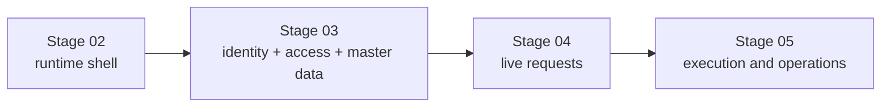
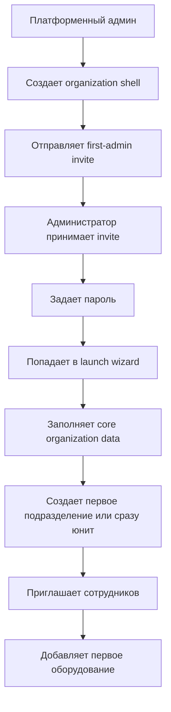
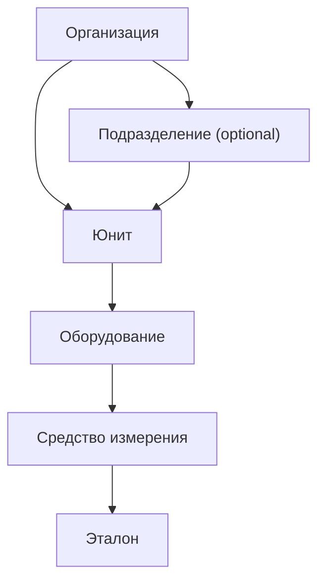
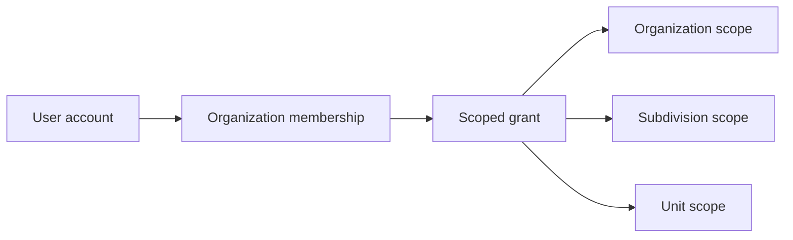

# Identity, Access, and Master Data

Статус: accepted baseline  
Обновлено: 2026-04-18

## Назначение

Этот документ фиксирует каноническую доменную модель для `Stage 03` в VRK:

- активация первого администратора организации;
- иерархия `организация -> подразделение -> юнит`;
- сотрудники, приглашения, membership и scoped access;
- master-data контур для договоров, оборудования, СИ и эталонов;
- правила архивирования и справочников.

Это не замена `docs/roadmap.md`, а более узкий source of truth для решений, которые уже не помещаются в короткое stage summary.

## Смежные документы

- roadmap и stage boundaries: [`docs/roadmap.md`](../roadmap.md)
- product scope: [`docs/PRD-MVP.md`](../PRD-MVP.md)
- web flow mapping: [`docs/design/customer-admin-bootstrap-flow.md`](../design/customer-admin-bootstrap-flow.md)
- frontend growth path: [`docs/architecture/frontend-architecture.md`](./frontend-architecture.md)
- stage artifacts: [`.agent/stages/03-identity-master-data/`](../../.agent/stages/03-identity-master-data/)

## Граница stage-ов

`Stage 02` поднимает только runtime shell и truthful placeholders.  
`Stage 03` включает реальную доменную активацию.  
`Stage 04` начинает живой request contour на уже существующем master-data слое.

## 1. Активация организации и первого администратора

Основной сценарий запуска организации:

1. платформенный админ создает заготовку организации;
2. указывает email первого администратора;
3. система отправляет одноразовое приглашение;
4. пользователь открывает ссылку, задает пароль;
5. после входа попадает в launch wizard.

Решения:

- основной путь: `invite link + password setup`;
- ручная раздача логина/пароля не используется как основной сценарий;
- внешний вход вроде Яндекс ID допустим позже как дополнительный путь после открытия приглашения, но не как замена invite acceptance в MVP;
- `invite code` допустим только как резервный offline-friendly сценарий;
- после активации пользователь не попадает в пустой кабинет, а в мастер первичной настройки.

## 2. Иерархия объектов

Базовая operational chain для Stage 03:

### 2.1. Организация

Организация является tenant-контейнером.

На старте обязательны только поля, без которых нельзя начать оргструктуру и вести оборудование:

- тип организации / ОПФ;
- полное и сокращенное наименование;
- ИНН;
- КПП;
- юридический адрес;
- основной контактный email;
- основной контактный телефон;
- логотип опционально.

Отдельным неблокирующим блоком живут реквизиты и документы:

- почтовый адрес;
- ОГРН;
- ОКПО;
- ФИО руководителя;
- должность руководителя;
- основание полномочий;
- файлы документов.

### 2.2. Подразделение

В модели используется единый термин `подразделение`, а не жесткое `филиал`.

Обязательные атрибуты:

- тип подразделения;
- наименование;
- код;
- регион;
- адрес;
- руководитель;
- контакты;
- статус `active` / `archived`.

Поддерживаются типы вроде:

- филиал;
- дивизион;
- представительство;
- регион;
- другие согласованные типы.

### 2.3. Юнит

Юнит является primary operational scope для оборудования, заявок и доступа.

Обязательные правила:

- юнит может иметь родительское подразделение, но оно не обязательно;
- сценарий `organization -> unit` должен поддерживаться так же, как `organization -> subdivision -> unit`;
- оборудование живет в контексте юнита, а не только организации в целом.

Минимальные поля:

- тип юнита;
- родительская организация;
- родительское подразделение опционально;
- наименование;
- код;
- адрес;
- ответственный;
- контакты;
- статус;
- комментарий.

## 3. Пользователи, membership и доступ

Stage 03 разделяет три разных сущности:

1. `Account` — кто человек как пользователь платформы;
2. `Membership` — состоит ли он в конкретной организации;
3. `Scoped grant` — что он может делать и в какой области действия.

### 3.1. Scoped access

Грант доступа описывается комбинацией:

- шаблон роли;
- область действия;
- набор позитивных разрешений.

MVP-модель прав:

- scope `organization` действует на всю иерархию ниже;
- scope `subdivision` действует на дочерние юниты;
- scope `unit` действует только на конкретный юнит;
- deny-layer в MVP не вводится;
- права суммируются, а не конфликтуют между собой.

Примеры role templates:

- админ организации;
- менеджер подразделения;
- админ юнита;
- метролог;
- наблюдатель.

### 3.2. Приглашения сотрудников

Flow приглашения сотрудника:

1. админ выбирает `Пригласить сотрудника`;
2. задает email, ФИО, должность, шаблон роли, scope и срок жизни ссылки;
3. система отправляет письмо;
4. сотрудник принимает приглашение;
5. дозаполняет профиль;
6. видит только свой контур доступа.

Статусы приглашения:

- `draft`
- `sent`
- `opened`
- `accepted`
- `expired`
- `revoked`

## 4. Навигация и рабочие пространства

Навигация строится вокруг выбора контекста:

- `Организация` — обзор всех подразделений, юнитов и оборудования организации;
- `Подразделение` — обзор только своего поддерева и всех его юнитов;
- `Юнит` — основной operational workspace для оборудования, СИ, эталонов и связанных действий.

Главные экраны:

- организация: сводка по оборудованию, сотрудникам, договорам и структуре;
- подразделение: сводка по юнитам и оборудованию внутри подразделения;
- юнит: рабочее место со списком оборудования, СИ, эталонов и точками входа в CRUD.

## 5. Оборудование, СИ и эталоны

### 5.1. Оборудование

Оборудование создается отдельной карточкой, без принудительной mega-form с метрологией.

Минимальные поля:

- производитель;
- классификация;
- модель;
- полное наименование;
- заводской номер;
- инвентарный номер;
- год выпуска;
- статус;
- юнит;
- документы;
- комментарий.

После создания карточки оборудование может жить без метрологии, если она не нужна.

### 5.2. Средства измерения

СИ являются отдельной сущностью, а не просто вложенным набором полей в оборудовании.

Минимальные поля:

- наименование / тип / модель;
- регистрационный номер;
- заводской номер;
- статус;
- владелец / юнит;
- признак `встроенное в оборудование` или `самостоятельное`.

### 5.3. Эталоны

Эталон является отдельным реестром.

Минимальные поля:

- тип / модель;
- идентификатор / серийный номер;
- метрологические характеристики;
- владелец;
- scope владения: юнит / подразделение / организация;
- статус;
- документы.

### 5.4. Журналы операций

Для СИ и эталонов источником правды является журнал метрологических операций, а не только пара дат в карточке.

Запись журнала хранит:

- вид операции;
- номер документа;
- дата операции;
- `действует до`;
- организацию-исполнителя;
- вложение;
- комментарий.

Правило расчета:

- текущий статус и ближайшая дата рассчитываются из последней действующей записи журнала;
- денормализованные поля на карточке допустимы как cache/view-model, но не как единственный источник правды.

### 5.5. Связи между оборудованием, СИ и эталонами

Stage 03 не использует жесткую связь `1:1` между СИ и эталоном.

Поддерживаемая модель:

- у оборудования может быть `0..N` СИ;
- у СИ может быть `0..N` эталонов;
- один эталон может повторно использоваться в нескольких операциях или для нескольких СИ.

Связь допускается:

- через таблицу назначений;
- через журнал операций.

## 6. Справочники и lifecycle rules

Для MVP используются как системные, так и organization-scoped справочники:

- производители;
- классификации;
- типы подразделений;
- типы юнитов;
- виды метрологических операций;
- типы эталонов.

Если глобального справочника еще нет, пользователь может создать локальный draft entry:

- запись видна только в своей организации;
- позже может быть нормализована в системный справочник;
- это предпочтительнее, чем блокировать ввод или плодить ad-hoc текстовые поля.

## 7. Архивирование и явные non-goals

Ключевые сущности не удаляются физически:

- организация;
- подразделение;
- юнит;
- пользователь;
- договор;
- оборудование;
- средство измерения;
- эталон.

Для MVP сознательно откладываются:

- Яндекс ID как обязательный путь входа;
- 2FA;
- массовый Excel import;
- ручная сборка кастомных ролей по чекбоксам;
- сложные уведомления и напоминания;
- автосоздание оргструктуры из внешних систем;
- отдельный самостоятельный метрологический модуль вне master-data contour.
