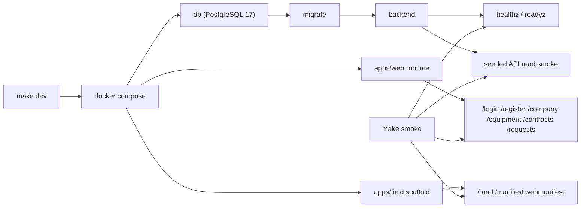

# Platform Runtime Baseline

Статус: accepted baseline  
Обновлено: 2026-04-18

## Назначение

Этот документ фиксирует минимальный runtime/platform floor, который `Stage 02` должен оставить после себя для следующих stage-run'ов: reproducible stack startup, health/readiness checks, CI hooks и scaffold для полевого контура.

## Что входит в baseline

- root `make dev` поднимает `db`, `migrate`, backend, `apps/web`, `apps/field`;
- root `make smoke` проверяет:
  - backend `healthz` и `readyz`;
  - seeded API read smoke;
  - `apps/web` runtime routes `/login`, `/register`, `/company`, `/equipment`, `/contracts`, `/requests`;
  - `apps/field` root page и `/manifest.webmanifest`;
- host ports по умолчанию:
  - backend: `18080`
  - web: `3100`
  - field: `3102`
- host ports можно переопределить через `BACKEND_HOST_PORT`, `WEB_HOST_PORT`, `FIELD_HOST_PORT`;
- backend build/test path доступен через контейнерные scripts и не требует локального `go`.

## Чего baseline не обещает

- real auth/session/RBAC;
- persisted Stage 03 master-data flows;
- live request lifecycle из `Stage 04`;
- Stage 06 offline engine для field-контура.

## Контейнерный контур

Диаграмма фиксирует именно Stage 02 platform floor: compose-сеть поднимает БД, миграции и backend до web/field surfaces, а smoke проверяет только те контуры, которые уже доказаны, без раннего включения Stage 03/04/06 поведения.

## CI baseline

- `frontend-workspaces` job гоняет `pnpm run web:smoke` и `pnpm run field:smoke`;
- `backend-container-checks` job гоняет container-backed `go test ./...` и `go build ./...`;
- `platform-stack-smoke` job поднимает тот же compose stack и запускает `make smoke`.

## Операционные заметки

- Если локально уже заняты стандартные frontend ports, compose не должен ломаться: используются отдельные host defaults `3100` и `3102`.
- Внешний порт PostgreSQL не пробрасывается, потому что Stage 02 smoke не требует прямого host-доступа к контейнерной БД.
- `apps/field` пока intentionally narrow: installable shell + sync boundaries. Offline storage, retry queue state machine и conflict flows остаются позднее.
