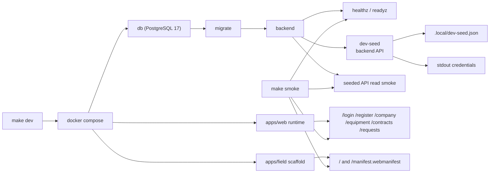
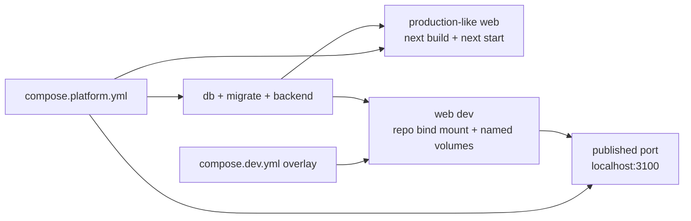

# Platform Runtime Baseline

Статус: accepted baseline  
Обновлено: 2026-04-29

## Назначение

Этот документ фиксирует минимальный runtime/platform floor, который `Stage 02` должен оставить после себя для следующих stage-run'ов: reproducible stack startup, health/readiness checks, CI hooks и scaffold для полевого контура.

## Что входит в baseline

- root `make dev` поднимает `db`, `migrate`, backend, `apps/web`, `apps/field`, дожидается container health через compose `--wait`, а затем запускает one-shot `dev-seed`;
- `dev-seed` создает локальную demo organization через backend API, а не через бизнес-данные в миграциях: first-admin invite, accept, `/company/profile`, `/company/divisions`, `/company/units`;
- session-authenticated API calls accept both local `Authorization: Bearer <token>` and deployment-safe `X-VRK-Session-Token: <token>`; web server proxies and `dev-seed` use the latter so the same flow works behind Yandex Serverless Container public endpoints;
- `dev-seed` печатает URL, email/password, organization id, 3 филиала и 9 юнитов в stdout, а полный локальный результат сохраняет в gitignored `.local/dev-seed.json` с правами `0600`;
- таблица `dev_seed_runs` хранит только marker/idempotency metadata и non-secret result JSON; пароль не пишется в БД;
- root `make smoke` проверяет:
  - backend `healthz` и `readyz`;
  - seeded API read smoke;
  - `apps/web` runtime routes `/login`, `/register`, `/company`, `/equipment`, `/contracts`, `/requests`;
  - `apps/field` root page и `/manifest.webmanifest`;
  - допускает короткое bounded ожидание host-портов сразу после свежего `make dev`, чтобы не падать на transient `Connection refused`, пока published ports догоняют container health;
- host ports по умолчанию:
  - backend: `18080`
  - web: `3100`
  - field: `3102`
- host ports можно переопределить через `BACKEND_HOST_PORT`, `WEB_HOST_PORT`, `FIELD_HOST_PORT`;
- `make smoke` требует доступный `python3` в локальном shell;
- `make down` сохраняет named Postgres volume и marker успешного dev seed, а `make clean` пересоздает clean-room baseline для повторного seeded proof;
- backend build/test path доступен через контейнерные scripts и не требует локального `go`.
- `compose.dev.yml` является официальным dev overlay для hot reload `apps/web`: он переиспользует `db`, `migrate`, `backend` и published port `3100` из `compose.platform.yml`, но запускает `web` через `pnpm --filter @vrk/web dev --hostname 0.0.0.0 --port 3000`;
- root `make web-dev` поднимает тот же overlay для локальной UI-разработки, не заменяя production-like `make dev` / `make smoke` contract.

## Чего baseline не обещает

- production-grade auth/RBAC или production seed policy;
- полный Stage 03 master-data fixture за пределами локального demo organization graph;
- live request lifecycle из `Stage 04`;
- Stage 06 offline engine для field-контура.

## Контейнерный контур



Диаграмма фиксирует platform floor после локального dev seed: compose-сеть поднимает БД, миграции и backend до web/field surfaces, затем one-shot seed идет через backend API и сохраняет локальные credentials. Smoke по-прежнему проверяет host-facing runtime contract без расширения в Stage 04/06 поведение.

## Web hot reload contour

`compose.platform.yml` остается production-like source of truth для проверки контейнерного web image:

```bash
docker compose -f compose.platform.yml up -d --build web
```

Для разработки UI без rebuild на каждое изменение используется overlay:

```bash
docker compose -f compose.platform.yml -f compose.dev.yml up web
```

Он сохраняет тот же внешний URL `http://localhost:3100`, потому что port mapping наследуется из базового `web` service. Отличается только способ запуска контейнера:

- production-like: `apps/web/Dockerfile` устанавливает зависимости, выполняет `pnpm --filter @vrk/web build`, затем запускает `pnpm --filter @vrk/web start`;
- dev hot reload: `compose.dev.yml` монтирует repo в `/workspace`, держит `node_modules`, pnpm store и `apps/web/.next` в named volumes, затем запускает `pnpm --filter @vrk/web dev --hostname 0.0.0.0 --port 3000`;
- polling flags `CHOKIDAR_USEPOLLING=true` и `WATCHPACK_POLLING=true` включены для Docker Desktop на macOS.



Диаграмма фиксирует только runtime choice для `web`: оба контура используют один backend/db baseline и один host-facing порт, но production-like image проверяет build/start contract, а dev overlay оптимизирован под source hot reload.

Пересборка production-like контейнера остается обязательной после изменений `package.json`, `pnpm-lock.yaml`, `apps/web/Dockerfile`, а также перед smoke/prod-like verification. Если менялся `apps/web/Dockerfile.dev`, пересоберите dev overlay отдельно через `docker compose -f compose.platform.yml -f compose.dev.yml build web`. Для обычных изменений исходников в `apps/web` достаточно dev overlay; если изменились зависимости во время запущенного dev-сервера, перезапустите overlay, чтобы startup `pnpm install --frozen-lockfile` обновил container volumes.

## CI baseline

- workflow `.github/workflows/platform-baseline.yml` wired так, чтобы `frontend-workspaces` запускал `pnpm run web:smoke` и `pnpm run field:smoke`;
- `pnpm run web:smoke` покрывает не только lint/typecheck/build/storybook, но и headless browser-smoke для client-side submit path `/login` и `/register` -> `/company`;
- тот же workflow wired так, чтобы `backend-container-checks` запускал container-backed `go test ./...` и `go build ./...`;
- `platform-stack-smoke` в workflow wired к тому же compose stack и `make smoke`;
- authoritative Stage 02 PASS bundle доказывает локальное воспроизведение этих команд, но не включает GitHub Actions run artifact.

## Операционные заметки

- Если локально уже заняты стандартные frontend ports, compose не должен ломаться: используются отдельные host defaults `3100` и `3102`.
- `make dev-seed` можно запускать отдельно после поднятого stack; при уже успешной версии он не создает дубли и переписывает `.local/dev-seed.json` из marker metadata.
- `X-VRK-Session-Token` is the preferred app-session header for server-to-backend calls in deployed serverless environments; `Authorization: Bearer` remains supported for local Compose, smoke tests, and backward compatibility.
- Agent-driven feature work must use the existing compose-backed runtime on `localhost:3100` for web verification. Do not start ad-hoc `next dev`, `pnpm dev`, `storybook dev`, static preview servers, or separate feature instances unless the user explicitly requests a dev server / separate instance in the prompt.
- Для локального `pnpm run web:smoke` нужен установленный Playwright Chromium; первый прогон на новой машине делайте через `pnpm run web:browser-install`.
- `make down` подходит для обычной остановки stack; если нужно заново доказать исходный seeded floor без влияния предыдущих записей или failed seed marker, сначала запускайте `make clean`.
- `make web-dev` подходит для foreground hot reload работы с `apps/web`. После проверки не оставляйте его запущенным в agent-сессии без явной необходимости; остановите `Ctrl+C`, а для detached-запуска используйте `docker compose -f compose.platform.yml -f compose.dev.yml stop web`.
- Внешний порт PostgreSQL не пробрасывается, потому что Stage 02 smoke не требует прямого host-доступа к контейнерной БД.
- `docker compose up --wait` фиксирует container health, но Stage 02 proof опирается на host-facing contract; поэтому `make smoke` сам коротко дожидается доступности `localhost:18080`, `localhost:3100` и `localhost:3102`, а затем выполняет обычные строгие assertions.
- `apps/field` пока intentionally narrow: manifest-backed shell + sync boundaries. Offline storage, retry queue state machine и conflict flows остаются позднее.
