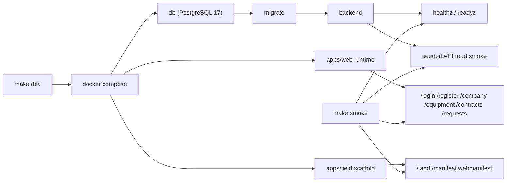

# Platform Runtime Baseline

Статус: accepted baseline  
Обновлено: 2026-04-18

## Назначение

Этот документ фиксирует минимальный runtime/platform floor, который `Stage 02` должен оставить после себя для следующих stage-run'ов: reproducible stack startup, health/readiness checks, CI hooks и scaffold для полевого контура.

## Что входит в baseline

- root `make dev` поднимает `db`, `migrate`, backend, `apps/web`, `apps/field` и дожидается container health через compose `--wait`;
- root `make smoke` проверяет:
  - backend `healthz` и `readyz`;
  - seeded API read smoke;
  - `apps/web` runtime routes `/login`, `/register`, `/company`, `/equipment`, `/contracts`, `/requests`;
  - `apps/field` root page и `/manifest.webmanifest`;
  - допускает короткое bounded ожидание host-портов сразу после свежего `make dev`, чтобы не падать на transient `Connection refused`, пока published ports догоняют container health;
- host ports по умолчанию:
  - backend: `18080`
  - web: `3100`
  - field: `3102`
- host ports можно переопределить через `BACKEND_HOST_PORT`, `WEB_HOST_PORT`, `FIELD_HOST_PORT`;
- `make smoke` требует доступный `python3` в локальном shell;
- `make down` сохраняет named Postgres volume, а `make clean` пересоздает clean-room baseline для повторного seeded proof;
- backend build/test path доступен через контейнерные scripts и не требует локального `go`.

## Чего baseline не обещает

- real auth/session/RBAC;
- persisted Stage 03 master-data flows;
- live request lifecycle из `Stage 04`;
- Stage 06 offline engine для field-контура.

## Контейнерный контур

Диаграмма фиксирует именно Stage 02 platform floor: compose-сеть поднимает БД, миграции и backend до web/field surfaces, а smoke проверяет только те контуры, которые уже доказаны, без раннего включения Stage 03/04/06 поведения.

## CI baseline

- workflow `.github/workflows/platform-baseline.yml` wired так, чтобы `frontend-workspaces` запускал `pnpm run web:smoke` и `pnpm run field:smoke`;
- `pnpm run web:smoke` покрывает не только lint/typecheck/build/storybook, но и headless browser-smoke для client-side submit path `/login` и `/register` -> `/company`;
- тот же workflow wired так, чтобы `backend-container-checks` запускал container-backed `go test ./...` и `go build ./...`;
- `platform-stack-smoke` в workflow wired к тому же compose stack и `make smoke`;
- authoritative Stage 02 PASS bundle доказывает локальное воспроизведение этих команд, но не включает GitHub Actions run artifact.

## Операционные заметки

- Если локально уже заняты стандартные frontend ports, compose не должен ломаться: используются отдельные host defaults `3100` и `3102`.
- Agent-driven feature work must use the existing compose-backed runtime on `localhost:3100` for web verification. Do not start ad-hoc `next dev`, `pnpm dev`, `storybook dev`, static preview servers, or separate feature instances unless the user explicitly requests a dev server / separate instance in the prompt.
- Для локального `pnpm run web:smoke` нужен установленный Playwright Chromium; первый прогон на новой машине делайте через `pnpm run web:browser-install`.
- `make down` подходит для обычной остановки stack; если нужно заново доказать исходный seeded floor без влияния предыдущих записей, сначала запускайте `make clean`.
- Внешний порт PostgreSQL не пробрасывается, потому что Stage 02 smoke не требует прямого host-доступа к контейнерной БД.
- `docker compose up --wait` фиксирует container health, но Stage 02 proof опирается на host-facing contract; поэтому `make smoke` сам коротко дожидается доступности `localhost:18080`, `localhost:3100` и `localhost:3102`, а затем выполняет обычные строгие assertions.
- `apps/field` пока intentionally narrow: manifest-backed shell + sync boundaries. Offline storage, retry queue state machine и conflict flows остаются позднее.
