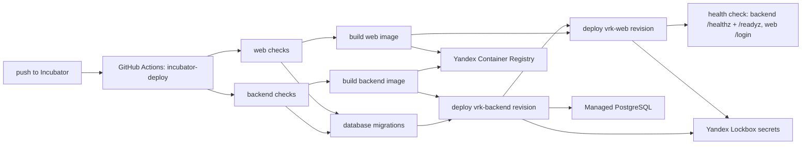

# Yandex Cloud Incubator Deployment

Статус: active incubator runbook  
Обновлено: 2026-04-29

## Назначение

Документ фиксирует CI/CD contract для автоматического деплоя ветки `Incubator` в Yandex Cloud. Контур предназначен для дешевого incubator-окружения: минимальный Managed PostgreSQL, scale-to-zero Serverless Containers и GitHub Actions без ручного деплоя с локальной машины.

## Ресурсы

Все runtime-ресурсы созданы в Yandex Cloud folder `vrk` (`b1g5et00t4pvrfoetdtc`), кроме VPC-сети: создание новой сети уперлось в cloud quota `vpc.networks.count`, поэтому incubator временно использует уже существующие `ncfg-network` / `ncfg-subnet-a`.

| Ресурс | Значение |
| --- | --- |
| Container Registry | `vrk-registry` (`crp2drtpijno96mlo81b`) |
| PostgreSQL cluster | `vrk-db` (`b1.medium`, `network-hdd`, 10 GB, PostgreSQL 16) |
| PostgreSQL database/user | `vrk` / `vrk_app` |
| PostgreSQL host | `rc1a-u2rouaenldfmev02.mdb.yandexcloud.net:6432` |
| Runtime secrets | Lockbox `vrk-incubator-secrets` |
| Backend container | `vrk-backend`, public URL `https://bbann5sjkg8iha0mmsl3.containers.yandexcloud.net` |
| Web container | `vrk-web`, public URL `https://bbamk7b1htc1ilji6l7v.containers.yandexcloud.net` |
| CI deployer SA | `vrk-deployer` |
| Runtime container SA | `vrk-container-sa` |

Cost guardrails:

- PostgreSQL uses the smallest available low-memory preset observed in the current folder (`b1.medium`) with the minimum 10 GB `network-hdd` disk.
- Both Serverless Containers default to `0` provisioned instances through repository variables `VRK_BACKEND_PROVISIONED` and `VRK_WEB_PROVISIONED`.
- Container images are cleaned by `registry-retention` after keeping the newest 20 sha-tagged images per repository.

## GitHub Secrets, Variables, And Lockbox

Runtime secrets are stored in Yandex Lockbox. GitHub Actions keeps only the bootstrap Yandex Cloud credential required to authenticate and read/deploy Yandex resources.

Repository secret configured for `vrk-app/vrk`:

- `YC_SA_JSON_CREDENTIALS`

Repository variables configured for `vrk-app/vrk`:

- `YC_FOLDER_ID`
- `YC_REGISTRY_ID`
- `YC_CONTAINER_SA_ID`
- `YC_LOCKBOX_SECRET_ID`
- `YC_LOCKBOX_VERSION_ID`
- `VRK_BACKEND_URL`
- `VRK_WEB_URL`
- `VRK_BACKEND_PROVISIONED`
- `VRK_WEB_PROVISIONED`

Lockbox owns the runtime secret payload:

- `DB_HOST`
- `DB_PORT`
- `DB_NAME`
- `DB_USER`
- `DB_PASSWORD`
- `DB_SSL_MODE`
- `PLATFORM_ADMIN_SHARED_SECRET`

The `YC_*_ID` values are identifiers, not secret payload. They are repository variables so workflow YAML can reference the correct folder, registry, runtime service account, and Lockbox version without duplicating runtime secrets in GitHub.

## Deploy Flow

The workflow is intentionally ordered so migrations complete before the backend revision is deployed, and the web revision is deployed only after the backend revision succeeds. The web container receives `INTERNAL_API_BASE_URL` and `NEXT_PUBLIC_API_BASE_URL` from `VRK_BACKEND_URL`.

## Workflows

- `.github/workflows/platform-baseline.yml` runs repo-level CI on `main`, `Incubator`, and pull requests.
- `.github/workflows/incubator-deploy.yml` runs checks, migrations, image builds, Serverless Container deploys, and health checks on every push to `Incubator`.
- `.github/workflows/registry-retention.yml` runs daily image retention and can be launched manually in dry-run mode.

## Operational Notes

- Direct public invocation is enabled for both incubator containers. This keeps the first incubator pipeline simple and cheap, but backend URL access should move behind API Gateway/custom domains before production hardening.
- The PostgreSQL host has a public IP so GitHub Actions can run migrations. If the database is later made private, the migration step must move into a Yandex-side runner or a dedicated migration container flow.
- The VPC network currently lives in the `ncfg` folder only because the cloud-level VPC network quota blocked a new `vrk` network. If quota is increased, create `vrk-network` / `vrk-subnet-a`, move `vrk-db`, and update this document.
- Next.js public environment values are build-time inputs. Local platform smoke passes `NEXT_PUBLIC_API_BASE_URL`, `NEXT_PUBLIC_RUNTIME_DATA_MODE`, and field sync mode as Docker build args in `compose.platform.yml`; the Incubator deploy workflow passes the backend URL as build args before pushing the web image.
