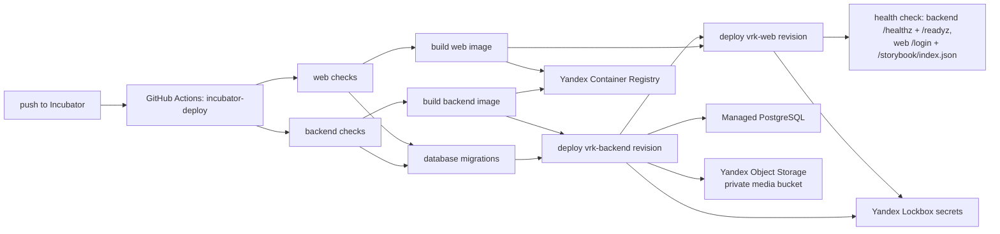
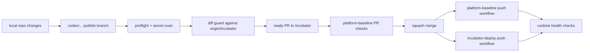

# Yandex Cloud Incubator Deployment

Статус: active incubator runbook  
Обновлено: 2026-05-12

## Назначение

Документ фиксирует CI/CD contract для автоматического деплоя ветки `Incubator` в Yandex Cloud. Контур предназначен для дешевого incubator-окружения: минимальный Managed PostgreSQL, scale-to-zero Serverless Containers и GitHub Actions без ручного деплоя с локальной машины.

## Ресурсы

Все runtime-ресурсы созданы в Yandex Cloud folder `vrk` (`b1g5et00t4pvrfoetdtc`), кроме VPC-сети: создание новой сети уперлось в cloud quota `vpc.networks.count`, поэтому incubator временно использует уже существующие `ncfg-network` / `ncfg-subnet-a`.

| Ресурс | Значение |
| --- | --- |
| Container Registry | `vrk-registry` (`crp2drtpijno96mlo81b`) |
| PostgreSQL cluster | `vrk-db` (`b1.medium`, `network-hdd`, 10 GB, PostgreSQL 16) |
| PostgreSQL database/user | `vrk` / `vrk_app` |
| PostgreSQL host | `rc1a-u2rouaenldfmev02.mdb.yandexcloud.net:6432` |
| Runtime secrets | Lockbox `vrk-incubator-secrets` |
| Object Storage | private S3-compatible bucket for organization logos and equipment photos; bucket name is stored as Lockbox `OBJECT_STORAGE_BUCKET` |
| Backend container | `vrk-backend`, public URL `https://bbann5sjkg8iha0mmsl3.containers.yandexcloud.net` |
| Web container | `vrk-web`, public URL `https://bbamk7b1htc1ilji6l7v.containers.yandexcloud.net` |
| Storybook | Public web route `https://bbamk7b1htc1ilji6l7v.containers.yandexcloud.net/storybook/` |
| CI deployer SA | `vrk-deployer` |
| Runtime container SA | `vrk-container-sa` |

Current IAM roles:

- `vrk-deployer`: `container-registry.images.pusher`, `container-registry.images.puller`, `lockbox.payloadViewer`, `lockbox.viewer`, `lockbox.editor`, `iam.serviceAccounts.user`, `serverless.containers.admin`, temporary folder-level `editor`.
- `vrk-deployer` also has explicit `iam.serviceAccounts.user` on `vrk-container-sa`, because `DeployRevision` uses that runtime identity.
- `vrk-container-sa`: `container-registry.images.puller`, `lockbox.payloadViewer`, `logging.writer`.

The broad `editor` role mirrors the working NCFG deployer pattern and is kept as a temporary incubator unblocker. Tighten this after the exact Yandex Cloud `DeployRevision` permission dependency is isolated.

Cost guardrails:

- PostgreSQL uses the smallest available low-memory preset observed in the current folder (`b1.medium`) with the minimum 10 GB `network-hdd` disk.
- Both Serverless Containers default to `0` provisioned instances through repository variables `VRK_BACKEND_PROVISIONED` and `VRK_WEB_PROVISIONED`.
- Container images are cleaned by `registry-retention` after keeping the newest 20 sha-tagged images per repository.

## GitHub Secrets, Variables, And Lockbox

Runtime secrets are stored in Yandex Lockbox. GitHub Actions keeps only the bootstrap Yandex Cloud credential required to authenticate and read/deploy Yandex resources.

Repository secret configured for `vrk-app/vrk`:

- `YC_SA_JSON_CREDENTIALS`

Repository variables configured for `vrk-app/vrk`:

- `YC_FOLDER_ID`
- `YC_REGISTRY_ID`
- `YC_CONTAINER_SA_ID`
- `YC_LOCKBOX_SECRET_ID`
- `YC_LOCKBOX_VERSION_ID`
- `VRK_BACKEND_URL`
- `VRK_WEB_URL`
- `VRK_BACKEND_PROVISIONED`
- `VRK_WEB_PROVISIONED`

Lockbox owns the runtime secret payload:

- `DB_HOST`
- `DB_PORT`
- `DB_NAME`
- `DB_USER`
- `DB_PASSWORD`
- `DB_SSL_MODE`
- `PLATFORM_ADMIN_SHARED_SECRET`
- `OBJECT_STORAGE_BUCKET`
- `OBJECT_STORAGE_ACCESS_KEY_ID`
- `OBJECT_STORAGE_SECRET_ACCESS_KEY`

The `YC_*_ID` values are identifiers, not secret payload. They are repository variables so workflow YAML can reference the correct folder, registry, runtime service account, and Lockbox version without duplicating runtime secrets in GitHub.

## Deploy Flow



The workflow is intentionally ordered so migrations complete before the backend revision is deployed, and the web revision is deployed only after the backend revision succeeds. The backend container receives S3-compatible Yandex Object Storage settings for private media: organization logos and equipment photos. The web container receives `INTERNAL_API_BASE_URL` and `NEXT_PUBLIC_API_BASE_URL` from `VRK_BACKEND_URL`; it also receives a derived `NEXT_PUBLIC_STORYBOOK_URL=${VRK_WEB_URL}/storybook/` and serves the static Storybook build from the same public endpoint.

Do not set `PORT` in Serverless Container revision env. Yandex Cloud reserves this environment variable and rejects web revision deployment with `INVALID_ARGUMENT: Environment variable PORT is forbidden`. The incubator web image starts Next.js on `${PORT:-8080}` through `apps/web/Dockerfile`; local Compose sets `PORT=3000`, while Yandex Cloud reaches the container on `127.0.0.1:8080`.

For session-authenticated backend calls in this Serverless Container topology, prefer `X-VRK-Session-Token` over the standard `Authorization` header. The public Yandex endpoint can reserve `Authorization` for cloud invocation auth before the request reaches the container. The backend remains backward-compatible with `Authorization: Bearer <token>` for local Compose and direct backend tests, while the web server proxy and dev seed use `X-VRK-Session-Token` for Incubator runtime calls.

## Workflows

- `.github/workflows/platform-baseline.yml` runs repo-level CI on `main`, `Incubator`, and pull requests.
- `.github/workflows/incubator-deploy.yml` runs checks, migrations, image builds, Serverless Container deploys, and health checks on every push to `Incubator`.
- `.github/workflows/registry-retention.yml` runs daily image retention and can be launched manually in dry-run mode.

All GitHub Actions workflows set top-level `FORCE_JAVASCRIPT_ACTIONS_TO_NODE24=true` so JavaScript actions run on the GitHub Actions Node.js 24 runtime ahead of the Node 20 deprecation path. This is separate from project runtime selection: `actions/setup-node` still installs Node.js `24.14.1` for the workspace, and runtime secrets stay in Yandex Lockbox.

## Publish To Incubator Runbook

Публикация в `Incubator` обслуживается repo-local skill:

```text
.agents/skills/vrk-incubator-publish/
```

Используй его для задач вида “закоммить текущие изменения”, “создай PR в Incubator”, “смержи и проверь деплой”. Stage harness доказывает готовность реализации, но не доказывает, что изменения корректно прошли GitHub PR, squash merge, push workflows и runtime health на Yandex Cloud.

Минимальный publish flow:



Диаграмма фиксирует release-readiness loop: PR checks и deploy proof являются отдельным слоем поверх stage evidence.

### Branch And Diff Guard

Если текущая ветка уже была squash-merged, не переиспользуй ее напрямую для нового PR. Это создает риск шумного PR, куда попадет старая история. Создай новую ветку и перенеси только follow-up commits на текущий `origin/Incubator`:

```text
git fetch --prune origin
git switch -c codex/<publish-branch>
git rebase --onto origin/Incubator origin/<old-squash-merged-branch>
.agents/skills/vrk-incubator-publish/scripts/diff_guard.sh origin/Incubator
```

`diff_guard.sh` должен показать, что `origin/Incubator` является merge-base для `HEAD`, и напечатать финальный `name-status` diff. Если guard красный, PR открывать нельзя: сначала нужно убрать уже squash-merged историю.

### Local Preflight

Перед PR:

```text
.agents/skills/vrk-incubator-publish/scripts/preflight.sh
.agents/skills/vrk-incubator-publish/scripts/mdb_preflight.sh
```

`preflight.sh` запускает `git diff --check` и secret-pattern scan по текущим changed files. `mdb_preflight.sh` проверяет, что Managed PostgreSQL cluster `vrk-db` находится в `RUNNING` и что `active_until` не истекает в ближайшее время. Если `yc` недоступен локально, зафиксируй это как skipped infra preflight и проверь состояние через GitHub deploy workflow или Yandex Cloud вручную.

### PR Checks And Merge

PR в `Incubator` должен быть ready, не draft. Заголовок PR должен следовать Conventional Commits, потому что repo policy использует squash merge и PR title становится итоговым commit message.

Ожидаемый порядок:

```text
.agents/skills/vrk-incubator-publish/scripts/watch_pr_checks.sh vrk-app/vrk <pr-number>
gh pr merge <pr-number> --repo vrk-app/vrk --squash --delete-branch
```

Если PR check падает, нужно читать failing job logs, чинить минимально на той же ветке и заново ждать checks. Не мержи PR с красным `platform-baseline`, если пользователь явно не берет риск на себя.

### Post-Merge Deploy Proof

После squash merge возьми новый SHA ветки `Incubator` и дождись push workflows:

```text
.agents/skills/vrk-incubator-publish/scripts/watch_commit_workflows.sh vrk-app/vrk <incubator-sha> platform-baseline.yml incubator-deploy.yml
.agents/skills/vrk-incubator-publish/scripts/runtime_health_check.sh
```

Runtime proof считается достаточным, если:

- backend `/healthz` возвращает успешный ответ;
- backend `/readyz` возвращает успешный ответ и не сообщает DB readiness failure;
- web `/login` доступен;
- web `/storybook/index.html` доступен;
- web `/storybook/index.json` доступен и не пустой.

Если `incubator-deploy` падает из-за stopped MDB или истекшего `active_until`, сначала восстанови infra state, затем rerun failed jobs или сделай новый исправляющий PR, если причина в коде.

### Publish Evidence

Для stage-bound публикаций фиксируй компактный machine-readable итог:

```text
.agent/stages/<stage-id>/publish.json
```

Рекомендуемые поля:

```json
{
  "base_branch": "Incubator",
  "head_branch": "codex/example",
  "pr": 0,
  "merge_sha": "",
  "local_checks": [],
  "pr_checks": [],
  "post_merge_workflows": [],
  "runtime_checks": [],
  "infra_notes": []
}
```

Длинные job logs не нужно переносить в контекст без необходимости. Достаточно run IDs, URLs, conclusion и кратких runtime результатов; подробные logs сохраняй в `.agent/stages/<stage-id>/raw/` только для диагностики отказа.

## Operational Notes

- Direct public invocation is enabled for both incubator containers. This keeps the first incubator pipeline simple and cheap, but backend URL access should move behind API Gateway/custom domains before production hardening.
- Storybook is intentionally public in the incubator web container at `/storybook/`; it has no separate auth gate, container, bucket, or CDN. The Object Storage bucket in this baseline is private and used only for organization logos and equipment photos served through authenticated backend/web proxy routes.
- The backend accepts both `Authorization: Bearer <token>` and `X-VRK-Session-Token: <token>` for application sessions. Incubator web-to-backend calls use the latter to avoid cloud-front interception of the standard authorization header.
- The PostgreSQL host has a public IP so GitHub Actions can run migrations. If the database is later made private, the migration step must move into a Yandex-side runner or a dedicated migration container flow.
- The VPC network currently lives in the `ncfg` folder only because the cloud-level VPC network quota blocked a new `vrk` network. If quota is increased, create `vrk-network` / `vrk-subnet-a`, move `vrk-db`, and update this document.
- Next.js public environment values are build-time inputs. Local platform smoke passes `NEXT_PUBLIC_API_BASE_URL`, `NEXT_PUBLIC_RUNTIME_DATA_MODE`, and field sync mode as Docker build args in `compose.platform.yml`; the Incubator deploy workflow passes the backend URL as build args before pushing the web image.
