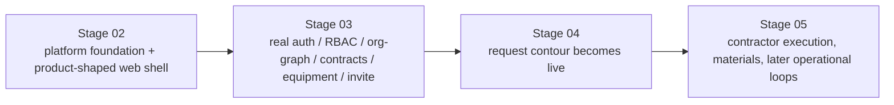
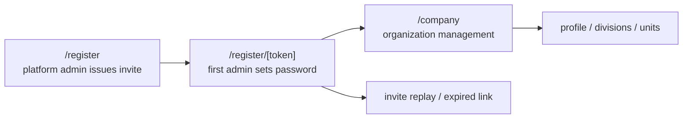
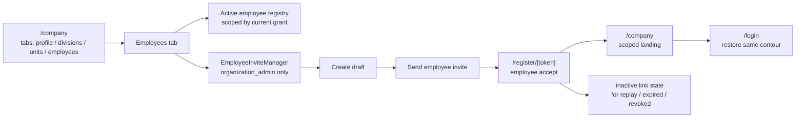
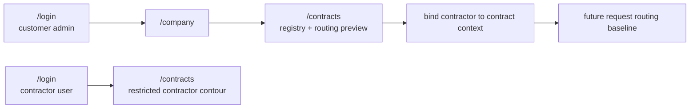
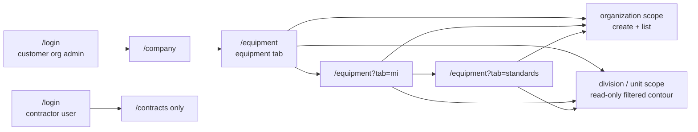
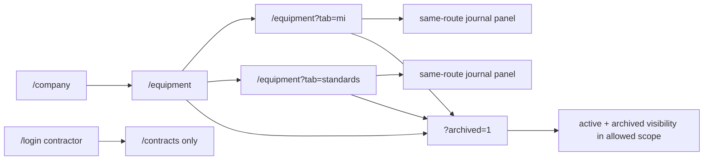
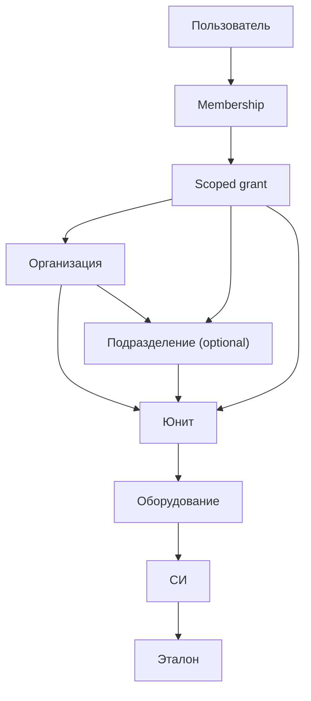

# Customer Admin Bootstrap Flow

Статус: accepted baseline  
Обновлено: 2026-04-29

## Назначение

Этот документ фиксирует, как user-provided Draw.io схема встраивается в текущий MVP roadmap VRK и где проходит каноническая граница между:

- `Stage 02` runtime/platform shell;
- `Stage 03` domain activation и master data;
- `Stage 04` request contour;
- более поздними operational ветками.

Сама большая Draw.io схема остается полезным обзорным артефактом, но **канонические stage boundaries** задаются этим документом и `docs/roadmap.md`.
Подробная доменная модель `Stage 03` вынесена в [`docs/architecture/identity-master-data.md`](../architecture/identity-master-data.md).

## Исходный артефакт

- editable Draw.io source: [`docs/design/diagrams/customer-admin-bootstrap-flow.drawio`](./diagrams/customer-admin-bootstrap-flow.drawio)
- origin: импортировано из user-provided файла `User flow (2).drawio` 2026-04-16

## Что покрывает исходная схема

Схема объединяет несколько разных слоев продукта:

- регистрация и вход;
- onboarding организации, подразделений и юнитов;
- оборудование и метрологические поля;
- сотрудники, приглашения и доступы;
- договоры, выбор подрядчика и приглашение подрядчика;
- плановые графики ТО/МО;
- материалы;
- более поздние ветки ремонта / модернизации / поставки.

Проблема схемы не в полноте, а в том, что она смешивает в один поток:

- ранний runtime shell;
- master data;
- request prerequisites;
- поздние contractor / operations сценарии.

Поэтому для roadmap она должна интерпретироваться поэтапно, а не как один monolithic Stage 02.

## Каноническая интерпретация для MVP

Диаграмма выше фиксирует не детальный UX, а **границу ответственности между stage-ами**. Большая Draw.io схема остается reference для route map и form surface coverage, но не отменяет stage split.

## Stage Mapping

### Stage 02: что переносим вперед

`Stage 02` должен реализовать не только голый platform bootstrap, но и **product-shaped runtime shell** для customer-admin flow:

- `/login`
- `/register`
- `/company` как company onboarding / profile shell
- `/equipment` как equipment contour:
  - empty state
  - add/import entry points
  - division / unit context selection shell
- `/contracts` как contracts contour:
  - create contract shell
  - contractor lookup / invite shell
- `/requests` только как truthful gated placeholder до `Stage 04`

Что разрешено в `Stage 02`:

- mock / seed / stub data;
- route-level forms и validation shell;
- shared API client и explicit contract boundaries;
- public web naming `contracts`, даже если backend resource пока остается `agreements` внутри adapter boundary;
- honest placeholders для еще не включенных контуров.

Что **не** должно притворяться готовым в `Stage 02`:

- real auth / RBAC;
- persisted org / division / unit / equipment / contract state;
- contractor invitation state machine;
- live request creation.

### Stage 03: что остается доменной активацией

`Stage 03` активирует те же surfaces из `Stage 02`, но уже на реальной доменной модели:

- first-admin activation по invite link и переход в постоянный `/company` management surface вместо ручной раздачи паролей и одноразового wizard;
- auth / logout / refresh / role-aware access;
- org model:
  - organization profile
  - divisions
  - units
  - users / memberships / scoped grants
- employee invitations и invitation lifecycle;
- contracts registry;
- contractor lookup / invitation / activation baseline в рамках договорного контура;
- contract status baseline;
- equipment registry;
- measuring instruments registry;
- standards registry;
- metrology operation journals;
- access boundaries for customer / contractor contours.

Именно здесь onboarding flow перестает быть shell и становится реальным master-data контуром: первый запуск, редактирование профиля, добавление филиалов/подразделений и добавление юнитов выполняются через один постоянный UI.

### Реализованный route contour для slice-001

Первый живой контур `Stage 03` уже не абстрактный, а маршрутизируемый:

- `/register` используется платформенным админом для выпуска first-admin invite;
- `/register/[token]` используется приглашенным администратором для password setup и accept;
- после accept пользователь попадает в `/company`; empty state и первые действия по настройке организации живут в том же постоянном route;
- `/company/setup` и launch wizard больше не являются целевым UX для Stage 03, даже если текущая historical implementation еще содержит этот route;
- профиль организации в `/company` использует selector `Тип` как ОПФ `ООО` / `АО` / `ПАО`; legacy aliases `ОАО -> ПАО`, `ЗАО -> АО`, `LLC -> ООО` поддерживаются только как входная совместимость и не показываются в UI;
- форма подразделения/филиала не содержит selector `Тип`; форма юнита сохраняет selector operational type `ВРД` / `ВРЗ` / `ВУ` / `ВРП`;
- повторный переход по использованной одноразовой ссылке показывает состояние `Одноразовая ссылка больше не активна`;
- анонимный `/company` shell из `Stage 02` сохраняется как truthful public state до появления активной session.

### Реализованный route contour для slice-002

Второй живой Stage 03 slice не создает новый invite route family, а расширяет тот же entry path:

- organization admin завершает bootstrap и остается на `/company`, где четвертая вкладка `Сотрудники` объединяет активный employee registry и admin-only employee invite lifecycle;
- employee invite выдается из `/company`, а одноразовая ссылка снова ведет в `/register/[token]`;
- после employee acceptance и последующего login тот же `/company` route становится scope-aware landing:
  - organization scope показывает полный org graph и, при `view_employees`, вкладку `Сотрудники`;
  - division scope показывает только свое поддерево и read-only employees registry для `division_head` / scoped `auditor`;
  - unit scope показывает только один юнит без расширения вверх и read-only employees registry для `unit_head` / scoped `auditor`;
  - `division_operator` и `unit_operator` не получают вкладку `Сотрудники`;
- edit/deactivate controls и приглашения остаются только у active customer `organization_admin`;
- replay, expired и revoked employee links возвращают пользователя в состояние `Одноразовая ссылка больше не активна`, а не в ложный success flow.

### Реализованный route contour для slice-003

Третий Stage 03 slice оживляет contracts contour без widening в Stage 04 request flow:

- customer organization admin остается на `/company` после login, но управляет живым registry через `/contracts`;
- `/contracts` теперь содержит create/update contract flow, contractor binding и routing preview вместо shell-only copy;
- публичное naming `contracts` сохраняется, а backend `/agreements` остается только внутренним adapter boundary;
- contractor organization после login и session restore попадает прямо на `/contracts`, а не в generic `/company`;
- contractor-side `/contracts` показывает только договоры, привязанные к его contractor organization, без broader customer graph и без unrelated customer contracts.

### Реализованный route contour для slice-004

Четвертый Stage 03 slice оживляет customer-side equipment/master-data contour без widening в Stage 04 request flow:

- customer organization admin после login остается на `/company`, но открывает live master-data registry через публичный route `/equipment`;
- `/equipment` остается одним public contour и не дробится на отдельные route families для СИ или эталонов;
- отдельные registry surfaces переключаются query-backed tab state:
  - `/equipment`
  - `/equipment?tab=mi`
  - `/equipment?tab=standards`
- organization-scope `organization_admin` получает create/list surface для equipment, measuring instruments и standards;
- division-scope и unit-scope пользователи видят тот же route, но только в read-only режиме и только в рамках разрешенного subtree;
- contractor contour по-прежнему не расширяется в `/equipment` и остается на договорном `/contracts` boundary.

### Реализованный route contour для slice-005

Пятый Stage 03 slice не создает отдельный public route для journal/archive behavior, а расширяет тот же `/equipment` contour:

- customer organization admin остается на `/equipment` и работает внутри того же route family;
- tab state по-прежнему сохраняется в query:
  - `/equipment`
  - `/equipment?tab=mi`
  - `/equipment?tab=standards`
- archive visibility тоже становится query-backed и воспроизводится через `?archived=1`;
- journal history для СИ и эталонов открывается на том же contour, без выноса в отдельный `/journals` route family;
- archive action для equipment / MI / standards сохраняет record и убирает его из default active view, а не делает hard delete;
- division/unit users по-прежнему видят тот же route, но только в read-only scope-filtered contour, включая allowed journal/archive state;
- contractor contour не расширяется в journal/archive master-data surface и остается на `/contracts`.

Каноническая object/access chain для этого stage:

### Stage 04: где включается requests contour

Схема не должна уводить request flow в `Stage 02`.
`Stage 04` остается местом, где:

- requests tab становится живым product contour;
- request create flow использует уже существующие equipment / contracts;
- маршрутизация в contractor contour идет из договорного контекста.

Правило из PRD не меняется: request нельзя создать без зарегистрированного оборудования.

### Stage 05: что читать как later operational flow

Следующие куски Draw.io не тянут `Stage 02` вперед и должны оставаться в более позднем operational contour:

- согласование графиков ТО/МО между причастными подразделениями и юнитами;
- выбор стороны материалов и работа со справочником материалов;
- более поздние execution branches, где нужны assignment, evidence и contractor-side processing.

Ближайший текущий дом для этих веток в roadmap — `Stage 05`, а не `Stage 02`.

## Что не переносим в текущий MVP без явного roadmap change

В Draw.io есть ветки, которые выходят за текущий MVP guardrail и поэтому **не меняют** канонический roadmap автоматически:

- модернизация;
- поставка.

Текущий MVP roadmap зафиксирован вокруг трех типов работ:

- ремонт;
- ТО;
- поверка.

Если модернизация и поставка понадобятся в каноническом scope, это должно идти отдельным doc-sync и roadmap update, а не молча наследоваться из импортированной схемы.

## Практическое правило для следующих slices

Если ближайший slice затрагивает `apps/web`, он должен использовать эту границу:

1. Сначала route shell и truthful UX-переходы.
2. Потом реальная доменная активация этих же экранов.
3. Потом request flow.
4. Потом contractor/operations loops.

Иными словами: Draw.io помогает строить экранную карту, но не отменяет staged delivery.
