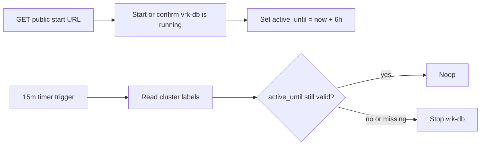

# Yandex Cloud VRK DB Control

`vrk-db` is intentionally on-demand. The public start function opens a 6-hour window, and the timer-driven autostop function closes the database after the `active_until` label expires.

This control path is cloud-only. There is no local repository script for starting or extending `vrk-db`.

## Resources

- Folder: `vrk` (`b1g5et00t4pvrfoetdtc`)
- PostgreSQL cluster: `vrk-db` (`c9qf8h0188hb4jolntie`)
- Runtime service account: `vrk-db-control-sa`
- Public start function: `vrk-db-start`
- Timer function: `vrk-db-autostop`
- Timer trigger: `vrk-db-autostop-15m`
- Source: `infra/yandex-cloud/vrk-db-control/index.py`

## Public Start URL

`GET https://functions.yandexcloud.net/d4ess1jd8mb1sqgk454l` starts or extends the DB session for 6 hours. The URL is intentionally public and unauthenticated, so anyone with the URL can trigger a DB start.

The start function uses the `start` handler. It starts the PostgreSQL cluster when it is stopped, waits for the cluster to become `RUNNING`, and writes these labels:

- `active_until`: Unix timestamp for the current session expiry.
- `managed_by`: `vrk-db-control`.

Calling the URL again extends `active_until` by another 6 hours from the call time.

## Autostop

The timer trigger invokes `vrk-db-autostop` every 15 minutes. If `vrk-db` is not stopped and `active_until` is missing or expired, the function sends a stop operation.

The autostop function uses the `autostop` handler. It does nothing while the cluster is stopped, in a transient status, or inside the active session window.

## Runtime Configuration

Both functions read configuration from environment variables:

- `VRK_DB_CLUSTER_ID`: required Yandex Managed PostgreSQL cluster ID.
- `VRK_DB_SESSION_HOURS`: optional session length, defaults to `6`.
- `VRK_DB_OPERATION_WAIT_SECONDS`: optional operation wait timeout, defaults to `240`.

The function runtime gets an IAM token from the Yandex Cloud metadata service through `vrk-db-control-sa`; no Lockbox payload or local `.env` file is required for the control path.
